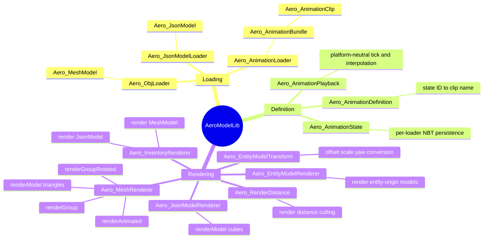
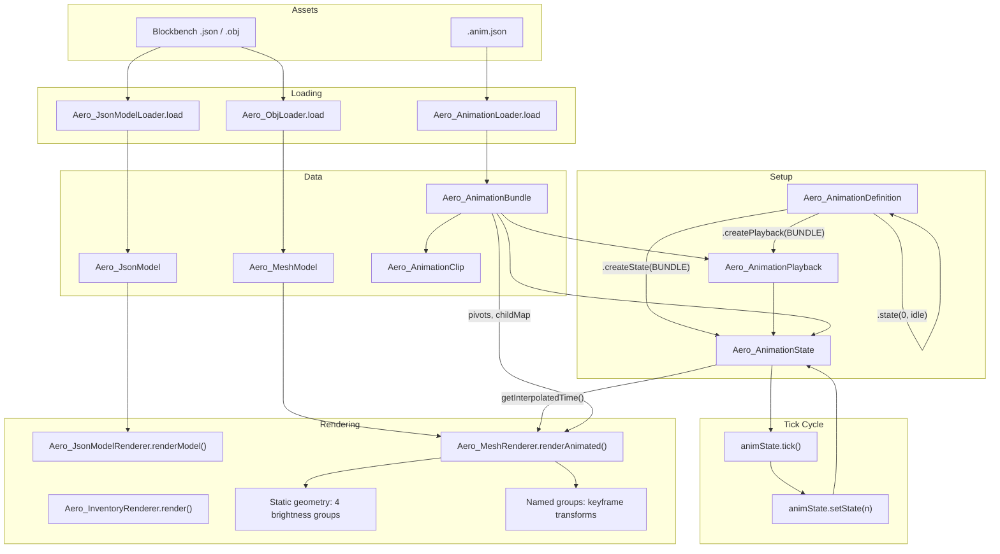
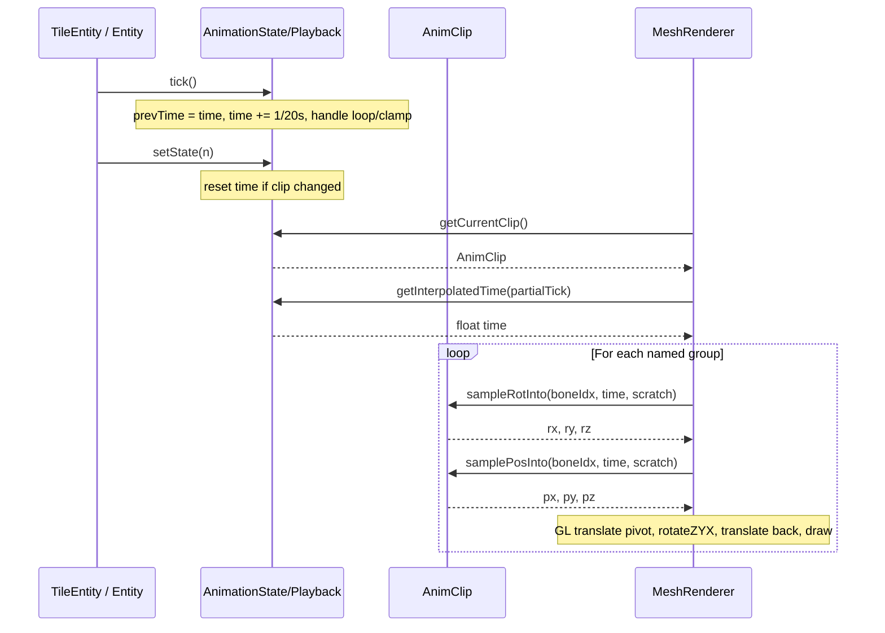
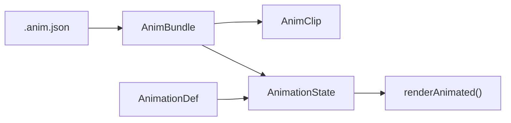
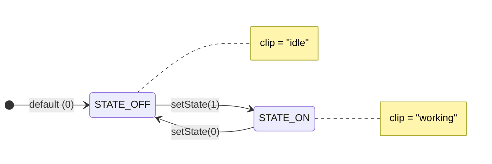
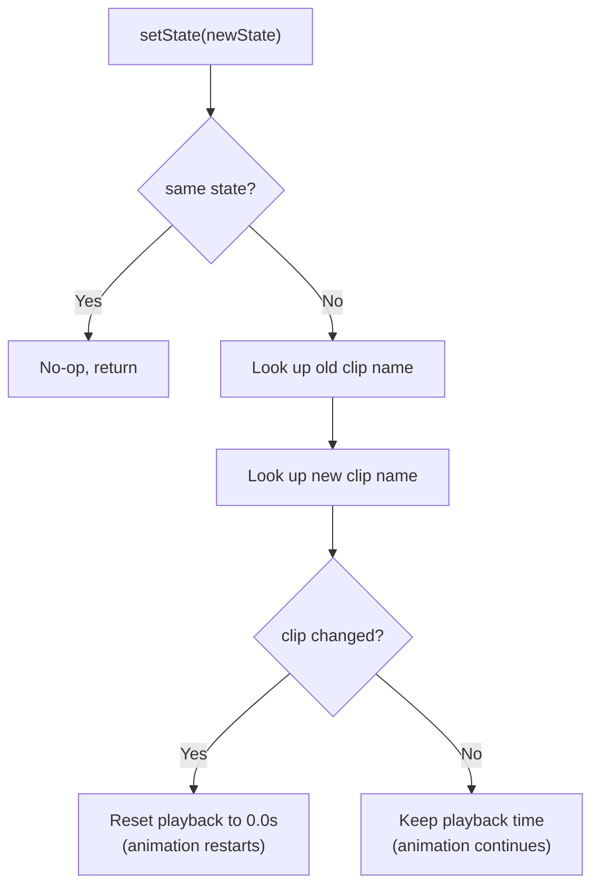
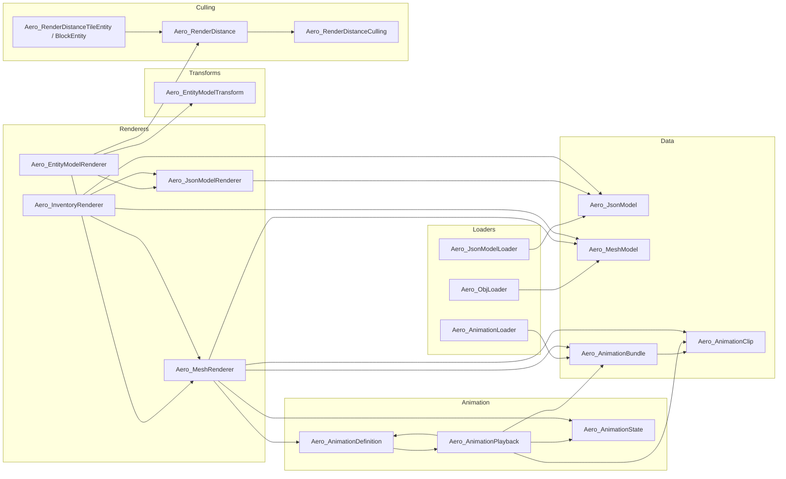

# AeroModelLib

> 3D rendering and animation library for Minecraft Beta 1.7.3 (RetroMCP/ModLoader and StationAPI).
> Like GeckoLib, but for Beta 1.7.3's OpenGL 1.1 pipeline.
> Author: lucasrgt - aerocoding.dev

**Compatibility:** Java 8 core/ModLoader | JDK 17 StationAPI build | Minecraft Beta 1.7.3 | RetroMCP | ModLoader/Forge 1.0.6 | StationAPI | LWJGL (OpenGL 1.1+)

---

## Table of Contents

1. [Quick Start](#1-quick-start)
2. [Architecture](#2-architecture)
3. [Static Models (Blockbench JSON)](#3-static-models-blockbench-json)
4. [OBJ Models (Mesh)](#4-obj-models-mesh)
5. [Animations](#5-animations)
6. [State Machine](#6-state-machine)
7. [API Reference](#7-api-reference)
8. [File Formats](#8-file-formats)
9. [Asset Workflow & Converter](#9-asset-workflow--converter)
10. [Patterns & Best Practices](#10-patterns--best-practices)
11. [Using with Entities (Mobs)](#11-using-with-entities-mobs)
12. [Troubleshooting](#12-troubleshooting)
13. [Full End-to-End Example](#13-full-end-to-end-example)
14. [Development, Tests & Benchmarks](#14-development-tests--benchmarks)

---

## 1. Quick Start

### Static model in 3 steps

```java
// 1. Load the model (static field — cached automatically)
public static final Aero_JsonModel MODEL = Aero_JsonModelLoader.load("/models/MyMachine.json");

// 2. In your TileEntitySpecialRenderer:
bindTextureByName("/block/my_texture.png");
float brightness = tileEntity.worldObj.getLightBrightness(x, y + 1, z);
Aero_JsonModelRenderer.renderModel(MODEL, d, d1, d2, 0f, brightness);

// 3. In your BlockRenderer (inventory):
Aero_InventoryRenderer.render(renderer, MODEL);
```

### Animated OBJ model in 5 steps

```java
// === TileEntity ===

// 1. Load animation and define states
public static final Aero_AnimationBundle   BUNDLE   = Aero_AnimationLoader.load("/models/MyMachine.anim.json");
public static final Aero_AnimationDefinition ANIM_DEF = new Aero_AnimationDefinition()
    .state(0, "idle")    // STATE_OFF = 0
    .state(1, "working"); // STATE_ON = 1

// 2. Create per-instance state
public final Aero_AnimationState animState = ANIM_DEF.createState(BUNDLE);

// 3. In updateEntity():
animState.tick();                                    // ALWAYS first
animState.setState(isRunning ? 1 : 0);               // AFTER tick

// 4. In readFromNBT/writeToNBT:
animState.readFromNBT(nbt);
animState.writeToNBT(nbt);

// === TileEntitySpecialRenderer ===

// 5. Load OBJ and render
public static final Aero_MeshModel MODEL = Aero_ObjLoader.load("/models/MyMachine.obj");

// In renderTileEntityAt():
bindTextureByName("/block/my_texture_hq.png");
Aero_MeshRenderer.renderAnimated(MODEL, BUNDLE, ANIM_DEF, tile.animState,
    d, d1, d2, brightness, partialTick);
```

### Entity model quick start

```java
// Entity field
public final Aero_AnimationState animState = ANIM_DEF.createState(BUNDLE);

// Entity tick
public void onLivingUpdate() {
    super.onLivingUpdate();
    animState.tick();
    animState.setState(isSwinging ? STATE_ATTACK : isMoving() ? STATE_WALK : STATE_IDLE);
}

// Renderer field: allocate once, not per frame
private static final Aero_EntityModelTransform MODEL_TRANSFORM =
    Aero_EntityModelTransform.DEFAULT
        .withOffset(-0.5f, 0f, -0.5f)
        .withScale(1f)
        .withCullingRadius(2f)
        .withMaxRenderDistance(96f);

// Renderer method
public void doRender(Entity entity, double x, double y, double z,
                     float yaw, float partialTick) {
    MyMob mob = (MyMob) entity;
    loadTexture("/mob/my_mob.png");
    Aero_EntityModelRenderer.renderAnimated(MODEL, mob.animState,
        entity, x, y, z, yaw, partialTick, MODEL_TRANSFORM);
}
```

---

## 2. Architecture

### Mindmap



### Full pipeline



### Sequence diagram (per frame)



### Separation of concerns

| Layer | Classes | Responsibility |
|-------|---------|---------------|
| **Data (immutable)** | `Aero_JsonModel`, `Aero_MeshModel`, `Aero_AnimationBundle`, `Aero_AnimationClip` | Store loaded data. Thread-safe. Store as `static final`. |
| **Loading (cached)** | `Aero_JsonModelLoader`, `Aero_ObjLoader`, `Aero_AnimationLoader` | Read files from classpath, parse, cache by path. |
| **Definition** | `Aero_AnimationDefinition` | Maps state IDs to clip names. One per machine/entity type. |
| **Playback (mutable)** | `Aero_AnimationPlayback` | Platform-neutral tick, setState, interpolation, clip cache. |
| **State (mutable)** | `Aero_AnimationState` | Loader-specific NBT wrapper around playback. |
| **Rendering** | `Aero_JsonModelRenderer`, `Aero_MeshRenderer`, `Aero_EntityModelRenderer`, `Aero_InventoryRenderer` | Static methods for OpenGL drawing. |
| **Transforms** | `Aero_EntityModelTransform` | Immutable offset/scale/yaw settings for entity-origin rendering. |
| **Culling** | `Aero_RenderDistance`, `Aero_RenderDistanceCulling`, `Aero_RenderDistanceTileEntity` / `Aero_RenderDistanceBlockEntity` | Keeps Aero renderers aligned with the player's render distance under a configurable cap instead of Beta's fixed 64-block special-render cutoff. |
| **LOD** | `Aero_RenderLod` | Chooses animated, static-at-rest or culled rendering from camera-relative distance. |

---

## 3. Static Models (Blockbench JSON)

### Workflow

1. **Blockbench:** File > Export > Export as JSON (`.json`)
2. **Save to:** `src/retronism/assets/models/MyMachine.json`
3. The transpiler copies it into the jar automatically

### Loading

```java
public static final Aero_JsonModel MODEL = Aero_JsonModelLoader.load("/models/MyMachine.json");
```

- Automatically cached by path
- Returns an immutable `Aero_JsonModel`

### World rendering

```java
// In TileEntitySpecialRenderer.renderTileEntityAt():
bindTextureByName("/block/my_texture.png");
float brightness = world.getLightBrightness(x, y + 1, z);
Aero_JsonModelRenderer.renderModel(MODEL, d, d1, d2, rotation, brightness);
```

**Parameters:**
- `d, d1, d2` — tile entity position (from renderTileEntityAt)
- `rotation` — Y rotation in degrees (0, 90, 180, 270). Rotates around block center
- `brightness` — 0.0-1.0, from `getLightBrightness()`

### Inventory rendering

```java
// In BlockRenderer.renderInventory():
int texID = ModLoader.getMinecraftInstance().renderEngine.getTexture("/block/my_texture.png");
ModLoader.getMinecraftInstance().renderEngine.bindTexture(texID);
Aero_InventoryRenderer.render(renderer, MODEL);
```

Auto-scales to fit the slot and centers at origin. The caller (RenderItem) already applies isometric rotation.

### Internal format (Aero_JsonModel)

Each element is a `float[30]`:

| Indices | Content |
|---------|---------|
| `[0-2]` | min position (x, y, z) in Blockbench units |
| `[3-5]` | max position (x, y, z) in Blockbench units |
| `[6-9]` | UV face DOWN (u1, v1, u2, v2) |
| `[10-13]` | UV face UP |
| `[14-17]` | UV face NORTH |
| `[18-21]` | UV face SOUTH |
| `[22-25]` | UV face WEST |
| `[26-29]` | UV face EAST |

At construction time, `Aero_JsonModel` also pre-bakes render quads into `quadsByFace[6]`.
Renderers consume those packed quads directly, so per-frame JSON rendering does not rebuild
scaled coordinates or UVs from the raw `elements` array.

UV = `-1` means missing face (renderer skips it).

---

## 4. OBJ Models (Mesh)

### Workflow

1. **Blockbench:** File > Export > Export OBJ Model (`.obj`)
2. **Save to:** `src/retronism/assets/models/MyMachine.obj` (only the .obj, .mtl is not used)
3. The transpiler copies it into the jar automatically

### Animated parts in OBJ

Use `o` or `g` directives in the OBJ to separate animated parts:

```obj
# Static geometry (unnamed = goes into main array)
v ...
f ...

# Animated part: turbine
o turbine_l
v ...
f ...

# Another animated part: shredder
o shredder_L
v ...
f ...
```

- Triangles **without** `o`/`g` group → static geometry
- Triangles **with** group → stored separately in `namedGroups`
- `renderModel()` draws only static geometry
- `renderAnimated()` draws everything (static + animated groups with transforms)

### Loading

```java
public static final Aero_MeshModel MODEL = Aero_ObjLoader.load("/models/MyMachine.obj");
```

### Brightness classification

During parsing, each triangle is classified into 1 of 4 groups by face normal:

| Group | Condition | Brightness factor |
|-------|-----------|-------------------|
| `GROUP_TOP` (0) | dominant +Y normal | 1.0 |
| `GROUP_BOTTOM` (1) | dominant -Y normal | 0.5 |
| `GROUP_NS` (2) | dominant Z normal | 0.8 |
| `GROUP_EW` (3) | dominant X normal | 0.6 |

This reduces `setColorOpaque_F` calls from O(N triangles) to 4 per frame.

### Rendering

#### Static (flat lighting)
```java
Aero_MeshRenderer.renderModel(MODEL, x, y, z, rotation, brightness);
```

#### Static (smooth lighting)
```java
Aero_MeshRenderer.renderModel(MODEL, x, y, z, rotation, world, originX, topY, originZ);
```
Bilinear light sampling at each triangle's centroid XZ position.

#### Individual group (manual GL control)
```java
// No push/pop — you control the GL state
GL11.glPushMatrix();
GL11.glTranslated(x, y, z);
// ... your transforms ...
Aero_MeshRenderer.renderGroup(MODEL, "fan", brightness);
GL11.glPopMatrix();
```

#### Group with pivot rotation
```java
float angle = tile.fanAngle + (tile.isActive ? 18f * partialTick : 0f);
Aero_MeshRenderer.renderGroupRotated(MODEL, "fan",
    d + ox, d1 + oy, d2 + oz, brightness,
    pivotX, pivotY, pivotZ,    // pivot in block units
    angle, 0f, 1f, 0f);       // angle + Y axis
```

#### Inventory
```java
Aero_InventoryRenderer.render(renderer, MODEL);
```

---

## 5. Animations

### Overview

The animation system is inspired by GeckoLib/Bedrock, adapted for Beta 1.7.3's OpenGL 1.1 pipeline.



### .anim.json format

```json
{
  "format_version": "1.0",
  "pivots": {
    "fan": [24.0, 44.5, 47.0]
  },
  "childMap": {
    "fan_blade_0": "fan",
    "fan_blade_1": "fan"
  },
  "animations": {
    "working": {
      "loop": true,
      "length": 2.0,
      "bones": {
        "fan": {
          "rotation": {
            "0": [0, 0, 0],
            "1": [-360, 0, 0],
            "2": [-720, 0, 0]
          },
          "position": {
            "0": [0, 0, 0]
          }
        }
      }
    }
  }
}
```

**Units:**
- **Pivots:** Blockbench pixels (automatically divided by 16 in the loader → block units)
- **Rotation:** Euler degrees [X, Y, Z], applied in **Z → Y → X** order (Bedrock/GeckoLib compatible)
- **Position:** Blockbench pixels (divided by 16 in the renderer → block units)
- **Time:** seconds (float)

### .anim.json sections

#### `pivots`
Rotation pivot for each bone. **Required** for bones that rotate.

```json
"pivots": {
  "turbine_l": [2.5, 24, 24],
  "shredder_L": [19, 50, 24]
}
```

Bones without a pivot default to `[0, 0, 0]`.

#### `childMap`
Hierarchy mapping between OBJ groups and animated bones.

```json
"childMap": {
  "turbine_l_blade_0": "turbine_l",
  "shred_blade_L_0_0": "shredder_L"
}
```

When the renderer encounters an OBJ group (e.g. `turbine_l_blade_0`) with no direct bone in the clip:
1. Looks up `childMap` → finds parent `turbine_l`
2. Uses the parent bone's transforms
3. If the parent also has no bone, walks up one level (grandparent)
4. If nothing found via childMap, falls back to **prefix matching** (e.g. `turbine_l_blade_0` → `turbine_l`)

#### `animations`
Each clip has:
- `loop` (boolean): whether it repeats
- `length` (float): duration in seconds
- `bones`: map of bone → channels (rotation, position)

Each channel is a `"time": [x, y, z]` map with keyframes. **Linear** interpolation.

### Loading

```java
public static final Aero_AnimationBundle BUNDLE = Aero_AnimationLoader.load("/models/MyMachine.anim.json");
```

### Defining states

```java
public static final int STATE_OFF = 0;  // Convention: 0 = off
public static final int STATE_ON  = 1;

public static final Aero_AnimationDefinition ANIM_DEF = new Aero_AnimationDefinition()
    .state(STATE_OFF, "idle")
    .state(STATE_ON,  "working");
```

- Builder pattern (chain `.state()` calls)
- `STATE_OFF` should be 0 (NBT default when key is absent)
- Clip names must exist in the `.anim.json`

### Creating per-instance state

```java
public final Aero_AnimationState animState = ANIM_DEF.createState(BUNDLE);
```

- **One per instance** (instance field, not static)
- Created via `AnimationDef.createState(bundle)`

### Tick cycle

```
updateEntity() {
    animState.tick();                          // 1. Advance 1/20s
    animState.setState(running ? 1 : 0);       // 2. Change state if needed
}
```

**CRITICAL:** `tick()` BEFORE `setState()`. Order matters for correct interpolation.

#### What `tick()` does:
1. Saves `prevPlaybackTime` (for inter-frame interpolation)
2. Advances `playbackTime += 1/20`
3. If looping: wraps at clip end (modulo)
4. If not looping: clamps at clip end

#### What `setState()` does:
1. If state unchanged: no-op
2. If clip changed: resets `playbackTime = 0`

### NBT persistence

```java
public void writeToNBT(NBTTagCompound nbt) {
    super.writeToNBT(nbt);
    animState.writeToNBT(nbt);  // Saves "Anim_state" and "Anim_time"
}

public void readFromNBT(NBTTagCompound nbt) {
    super.readFromNBT(nbt);
    animState.readFromNBT(nbt);  // Restores state and time
}
```

NBT keys:
- `"Anim_state"` — int (state ID)
- `"Anim_time"` — float (time in seconds)

### Rendering full animation

```java
Aero_MeshRenderer.renderAnimated(
    MODEL,                          // OBJ model with named groups
    Tile.BUNDLE,                    // animation data
    Tile.ANIM_DEF,                  // state->clip mapping
    tile.animState,                 // per-instance playback
    d + offsetX, d1 + offsetY, d2 + offsetZ,  // world position
    brightness,                     // 0.0-1.0
    partialTick                     // tick fraction (0.0-1.0)
);
```

This method:
1. Renders static geometry once with the animated groups in one shared GL state block
2. For each named group in the OBJ:
   - Resolves the bone (direct → childMap → prefix fallback)
   - Samples rotation, position and scale at interpolated time without per-frame allocations
   - Applies GL transform: translate(pivot + offset) → rotateZ → rotateY → rotateX → translate(-pivot)
   - Draws the group's triangles

### Sequence diagram (per frame)

See the [Architecture section](#sequence-diagram-per-frame) for the full Mermaid sequence diagram.

---

## 6. State Machine

### Overview

The animation system includes a built-in **state machine** that manages transitions between animation clips. It is intentionally simple: immediate transitions with no blending or crossfade — designed for discrete machine modes (idle/processing, on/off, etc.).



### Components

| Class | Role | Lifecycle |
|-------|------|-----------|
| `Aero_AnimationDefinition` | Maps state IDs → clip names (blueprint) | `static final`, one per machine/entity type |
| `Aero_AnimationPlayback` | Shared playback engine: tick, setState, interpolation, clip cache | One per animated instance when no Minecraft NBT adapter is needed |
| `Aero_AnimationState` | Loader-specific playback + NBT adapter | Instance field, one per TileEntity/Entity |

### Defining states

```java
public static final int STATE_OFF  = 0;  // Convention: 0 = off/idle
public static final int STATE_ON   = 1;
public static final int STATE_FAST = 2;

public static final Aero_AnimationDefinition ANIM_DEF = new Aero_AnimationDefinition()
    .state(STATE_OFF,  "idle")
    .state(STATE_ON,   "working")
    .state(STATE_FAST, "working_fast");
```

- State IDs are non-negative integers (0, 1, 2, ...)
- Convention: `0` = off/idle (NBT default when key is absent)
- Internally stored as a sparse array — IDs don't need to be sequential
- Multiple states **can** map to the same clip name

### Transition behavior

When `setState(newState)` is called:



Key behaviors:
- **Same state** → no-op (calling `setState(1)` while already in state 1 does nothing)
- **Different state, different clip** → playback resets to 0 (new animation starts from beginning)
- **Different state, same clip** → playback continues (useful for semantic states that share an animation)

### No blending

Transitions are **instantaneous** — there is no crossfade, interpolation, or transition duration between clips. The new clip starts immediately on the next frame. This keeps the system simple and predictable for machine animations.

### Edge cases

| Scenario | Behavior |
|----------|----------|
| Unknown state ID (not registered) | `currentState` updates, clip resolves to `null` → animation stops |
| Negative state ID | `getClipName()` returns `null` → same as unknown |
| Clip name not in `.anim.json` | `getCurrentClip()` returns `null` → renderer skips animation |
| `tick()` with null clip | Playback time resets to `0.0` → safe no-op |

### Multiple states, same clip

```java
// Both "overdrive" states use the same fast animation
public static final Aero_AnimationDefinition ANIM_DEF = new Aero_AnimationDefinition()
    .state(0, "idle")
    .state(1, "working")
    .state(2, "working")   // same clip as state 1
    .state(3, "overdrive");
```

Switching between state 1 and 2 **does not** reset the animation — the clip is the same so playback continues uninterrupted. The state ID still changes, so your logic can distinguish them.

### Loop boundary handling

For looping clips, the state machine handles the wrap-around correctly during partial-tick interpolation:

- When `playbackTime` wraps (resets past clip end), the interpolation detects `current < previous`
- It extends the current time past `clip.length` to interpolate smoothly across the boundary
- Then applies modulo to bring back into range
- Result: **no visible stutter** at loop boundaries

### Integration with tick cycle

```java
public void updateEntity() {
    animState.tick();                              // 1. Advance time
    animState.setState(isRunning ? 1 : 0);         // 2. Evaluate state
}
```

**Order matters:** `tick()` saves `prevPlaybackTime` for interpolation. If `setState()` is called first, a clip change would reset time before `tick()` saves it, causing interpolation artifacts on the transition frame.

---

## 7. API Reference

### Aero_JsonModel

Cube-based model container (Blockbench JSON).

| Field | Type | Description |
|-------|------|-------------|
| `name` | `String` | Model identifier |
| `elements` | `float[][]` | Array of cubes, each float[30] |
| `textureSize` | `float` | Texture resolution (default 128) |
| `scale` | `float` | Scale factor (default 16 = 1 block) |
| `invTextureSize` | `float` | Cached reciprocal used by pre-baked UVs |
| `invScale` | `float` | Cached reciprocal used by render/bounds paths |
| `quadsByFace` | `float[][][]` | Pre-baked packed quads grouped by face direction |

| Constructor | Description |
|-------------|-------------|
| `Aero_JsonModel(name, elements, textureSize, scale)` | Full constructor |
| `Aero_JsonModel(name, elements)` | textureSize=128, scale=16 |

---

### Aero_MeshModel

Triangulated model container (OBJ).

| Field | Type | Description |
|-------|------|-------------|
| `name` | `String` | Identifier |
| `scale` | `float` | Scale factor (default 1.0) |
| `invScale` | `float` | Cached reciprocal scale |
| `groups` | `float[][][]` | Static triangles per brightness group [4][N][15] |
| `namedGroups` | `Map<String, float[][][]>` | Animated parts, same 4-group structure |

| Constant | Value | Brightness |
|----------|-------|------------|
| `GROUP_TOP` | 0 | 1.0 |
| `GROUP_BOTTOM` | 1 | 0.5 |
| `GROUP_NS` | 2 | 0.8 |
| `GROUP_EW` | 3 | 0.6 |

| Method | Returns | Description |
|--------|---------|-------------|
| `triangleCount()` | `int` | Total triangles in static geometry |
| `triangleCountForGroup(name)` | `int` | Total triangles in a named group (0 if not found) |
| `getNamedGroup(name)` | `float[][][]` | Named group buckets, or `null` |
| `getBounds()` | `float[6]` | Cached AABB in block units |
| `getStaticSmoothLightData()` | `SmoothLightData` | Cached XZ footprint and triangle centroids for smooth lighting |

---

### Aero_AnimationBundle

Immutable container with animation data loaded from `.anim.json`.

| Field | Type | Description |
|-------|------|-------------|
| `clips` | `Map<String, Aero_AnimationClip>` | Clips indexed by name |
| `pivots` | `Map<String, float[]>` | Pivots in block units (already divided by 16) |
| `childMap` | `Map<String, String>` | childName → parentBoneName |

| Method | Returns | Description |
|--------|---------|-------------|
| `getClip(name)` | `Aero_AnimationClip` | Clip by name, or `null` |
| `getPivot(boneName)` | `float[3]` | Pivot in block units, or `[0,0,0]` |
| `getParentBoneName(childName)` | `String` | Parent bone from childMap, or `null` |

---

### Aero_AnimationClip

Immutable animation clip data with keyframes.

| Field | Type | Description |
|-------|------|-------------|
| `name` | `String` | Clip name |
| `loop` | `boolean` | Whether it loops |
| `length` | `float` | Duration in seconds |

| Method | Returns | Description |
|--------|---------|-------------|
| `indexOfBone(name)` | `int` | Bone index, or `-1` |
| `sampleRot(boneIdx, time)` | `float[3]` | Interpolated rotation [rx,ry,rz] in degrees, or `null` |
| `samplePos(boneIdx, time)` | `float[3]` | Interpolated position [px,py,pz] in pixels, or `null` |
| `sampleScl(boneIdx, time)` | `float[3]` | Interpolated scale [sx,sy,sz], or `null` |
| `sampleRotInto/PosInto/SclInto(...)` | `boolean` | Allocation-free sampler into caller scratch buffer |

Interpolation: linear by default, with optional step and Catmull-Rom modes. Sampling uses binary search and clamps outside keyframe bounds.

---

### Aero_AnimationDefinition

State ID → clip name mapping. One per machine/entity type.

| Method | Returns | Description |
|--------|---------|-------------|
| `state(stateId, clipName)` | `this` | Associates state with clip (builder pattern) |
| `getClipName(stateId)` | `String` | Clip name, or `null` |
| `createPlayback(bundle)` | `Aero_AnimationPlayback` | Creates platform-neutral playback (tests/tools) |
| `createState(bundle)` | `Aero_AnimationState` | Creates state for an instance |

---

### Aero_AnimationPlayback

Platform-neutral mutable playback state used by both ModLoader and StationAPI.

| Method | Returns | Description |
|--------|---------|-------------|
| `tick()` | `void` | Advances 1/20s. Call BEFORE setState() |
| `setState(stateId)` | `void` | Changes state. Resets time if clip changed. Call AFTER tick() |
| `getInterpolatedTime(partialTick)` | `float` | Smoothed time between ticks (for renderer) |
| `getCurrentClip()` | `Aero_AnimationClip` | Active clip, or `null` |
| `getBundle()` | `Aero_AnimationBundle` | Linked bundle |
| `getDef()` | `Aero_AnimationDefinition` | Linked def |

---

### Aero_AnimationState

Mutable per-instance animation state. Extends `Aero_AnimationPlayback` and adds the loader-specific NBT adapter.

| Field | Type | Description |
|-------|------|-------------|
| `currentState` | `int` (public) | Current state (accessible by renderer and logic) |

| Method | Returns | Description |
|--------|---------|-------------|
| `writeToNBT(nbt)` | `void` | Saves "Anim_state" and "Anim_time" |
| `readFromNBT(nbt)` | `void` | Restores (prev=current to avoid first-frame jump) |

---

### Aero_JsonModelLoader

Loads Blockbench JSON models from classpath.

| Method | Returns | Description |
|--------|---------|-------------|
| `load(resourcePath)` | `Aero_JsonModel` | Loads and caches |
| `load(resourcePath, name)` | `Aero_JsonModel` | Loads with explicit name |

**Export:** Blockbench > File > Export > Export as JSON

---

### Aero_ObjLoader

Loads OBJ models from classpath.

| Method | Returns | Description |
|--------|---------|-------------|
| `load(resourcePath)` | `Aero_MeshModel` | Loads and caches |
| `load(resourcePath, name)` | `Aero_MeshModel` | Loads with explicit name |

**Export:** Blockbench > File > Export > Export OBJ Model (only .obj, .mtl ignored)

**Supported:** `v`, `vt`, `vn` (ignored), `f` (tri/quad, fan triangulation), `o`/`g` (named groups), negative indices.

**UV:** Automatic V-flip (OBJ V=0 at bottom → Minecraft V=0 at top).

---

### Aero_AnimationLoader

Loads `.anim.json` from classpath.

| Method | Returns | Description |
|--------|---------|-------------|
| `load(resourcePath)` | `Aero_AnimationBundle` | Loads and caches |

Built-in JSON parser (recursive descent). No external dependencies.

---

### Aero_JsonModelRenderer

Renders `Aero_JsonModel` (cubes) with OpenGL.

| Method | Parameters | Description |
|--------|------------|-------------|
| `renderModel(model, x, y, z, rotation, brightness)` | `Aero_JsonModel`, position, Y rotation degrees, brightness 0-1 | World render |

**Per-face brightness:** Top=1.0, Bottom=0.5, N/S=0.8, E/W=0.6 (hardcoded, matches MeshModel).

---

### Aero_MeshRenderer

Renders `Aero_MeshModel` (OBJ triangles) with OpenGL.

| Method | Description |
|--------|-------------|
| `renderModel(model, x, y, z, rotation, brightness)` | Static geometry, flat lighting |
| `renderModelAtRest(model, x, y, z, rotation, brightness)` | Static geometry plus named groups at rest pose; useful for distant animation LOD |
| `renderModel(model, x, y, z, rotation, world, ox, topY, oz)` | Static geometry, smooth lighting (bilinear) |
| `renderGroup(model, groupName, brightness)` | Named group, NO push/pop (caller controls GL) |
| `renderGroupRotated(model, groupName, x, y, z, brightness, pivotX/Y/Z, angle, axisX/Y/Z)` | Group with pivot rotation |
| `renderAnimated(model, bundle, def, state, x, y, z, brightness, partialTick)` | Full keyframe-animated render |
| `renderAnimated(model, bundle, def, playback, x, y, z, brightness, partialTick)` | Same renderer with platform-neutral `Aero_AnimationPlayback` |
| `renderAnimated(model, playback, x, y, z, brightness, partialTick)` | Short form; playback already owns its definition and bundle |

---

### Aero_EntityModelRenderer

Entity-specific renderer wrapper for `Render` / `EntityRenderer` implementations. It keeps texture binding in the caller, rotates around the entity origin and delegates to the optimized JSON/Mesh renderers.

| Method | Description |
|--------|-------------|
| `render(jsonModel, entity, x, y, z, yaw, partialTick[, transform])` | Static JSON model, brightness read from entity |
| `render(meshModel, entity, x, y, z, yaw, partialTick[, transform])` | Static OBJ model, brightness read from entity |
| `renderAtRest(meshModel, entity, x, y, z, yaw, partialTick, transform)` | Static OBJ model plus named groups at rest pose |
| `renderAnimated(meshModel, playback, entity, x, y, z, yaw, partialTick[, transform])` | Animated OBJ model using `playback.getBundle()` / `playback.getDef()` |
| `renderAnimated(meshModel, bundle, def, playback, entity, x, y, z, yaw, partialTick[, transform])` | Animated OBJ model with explicit bundle/definition |
| `render(..., brightness[, transform])` | Brightness-explicit overloads for custom lighting |

The ModLoader adapter uses `entity.getBrightness(partialTick)`. The StationAPI adapter uses `entity.getBrightnessAtEyes(partialTick)`.

---

### Aero_EntityModelTransform

Immutable entity transform. Store as `static final`; do not allocate it inside render methods.

| Field / Method | Description |
|----------------|-------------|
| `DEFAULT` | Offset `(0,0,0)`, scale `1`, yaw offset `0` |
| `withOffset(x, y, z)` | Returns a copy with model-local offset |
| `withScale(scale)` | Returns a copy with uniform scale; scale must be finite and non-zero |
| `withYawOffset(degrees)` | Returns a copy with extra yaw adjustment |
| `withCullingRadius(blocks)` | Adds a visual radius margin to entity culling; use for models wider than the entity hitbox |
| `withMaxRenderDistance(blocks)` | Caps entity-model drawing distance; default is `96` blocks for high-distance stability |
| `modelYaw(entityYaw)` | Converts vanilla entity yaw to model-space yaw (`180 - entityYaw + yawOffset`) |

---

### Aero_RenderDistance

Loader-specific adapter for render-distance-aware culling. ModLoader reads
`Minecraft.gameSettings.renderDistance`; StationAPI reads
`EntityRenderDispatcher.INSTANCE.options.viewDistance`.

| Method | Description |
|--------|-------------|
| `currentViewDistance()` | Returns Beta's option value: Far `0`, Normal `1`, Short `2`, Tiny `3` |
| `currentBlockRadius()` | Maps the current option to an approximate block radius: `256`, `128`, `64`, `32` |
| `shouldRenderRelative(x, y, z, visualRadiusBlocks)` | Fast entity/model culling check for render-relative coordinates |
| `shouldRenderRelative(x, y, z, visualRadiusBlocks, maxRenderDistanceBlocks)` | Same check with an explicit cap for light/landmark models |
| `lodRelative(x, y, z, visualRadiusBlocks, animatedDistanceBlocks)` | Returns `Aero_RenderLod.ANIMATED`, `STATIC` or `CULLED` for animation LOD |
| `lodRelative(x, y, z, visualRadiusBlocks, animatedDistanceBlocks, maxRenderDistanceBlocks)` | LOD with an explicit max render cap |
| `applyEntityRenderDistance(entity, visualRadiusBlocks)` | Raises the entity dispatcher cutoff to the default safe Aero radius; `Aero_EntityModelRenderer` still culls drawing by the current render distance |
| `applyEntityRenderDistance(entity, visualRadiusBlocks, maxRenderDistanceBlocks)` | Entity dispatcher setup for a custom capped distance |

### Aero_RenderLod

Distance LOD result used by callers to avoid expensive animation work:

| Value | Recommended path |
|-------|------------------|
| `ANIMATED` | Full `renderAnimated(...)` |
| `STATIC` | `renderModelAtRest(...)` or `Aero_EntityModelRenderer.renderAtRest(...)` |
| `CULLED` | Skip texture binding, brightness sampling and drawing |

### Aero_RenderDistanceCulling

Pure Java math shared by both loaders and covered by unit tests. It also
normalizes block/tile entity distance for vanilla's hardcoded `64` block
special-renderer dispatcher limit.

### Aero_RenderDistanceTileEntity / Aero_RenderDistanceBlockEntity

Optional base classes for special-rendered models:

| Loader | Base class | Override |
|--------|------------|----------|
| ModLoader | `Aero_RenderDistanceTileEntity` | `protected double getAeroRenderRadius()` and optionally `getAeroMaxRenderDistance()` |
| StationAPI | `Aero_RenderDistanceBlockEntity` | `protected double getAeroRenderRadius()` and optionally `getAeroMaxRenderDistance()` |

Use these bases for large or animated tile/block entities. `getAeroRenderRadius()`
is a margin in blocks around the block center, not the full render distance.
`getAeroMaxRenderDistance()` defaults to `96` blocks so Far render distance does
not explode special-renderer count. Use `128` or `256` only for light models or
intentional landmarks.

---

### Aero_InventoryRenderer

Centralized inventory thumbnail rendering for all Aero model types. Auto-scales to fit the slot, centers at origin, and applies a Y nudge for visual alignment. The caller (RenderItem) already applies isometric rotation.

| Method | Description |
|--------|-------------|
| `render(rb, Aero_JsonModel)` | Renders a Blockbench JSON model as inventory thumbnail |
| `render(rb, Aero_MeshModel)` | Renders an OBJ model as inventory thumbnail (static + named groups at rest) |

Constants: `SLOT_SCALE = 1.3`, `Y_NUDGE = 0.12`

---

---

## 8. File Formats

### Blockbench JSON (`.json`)

Exported via Blockbench > File > Export > Export as JSON.

The loader extracts:
- `resolution.width` → textureSize (default 128)
- `elements[]` with `from`, `to`, `inflate`, `faces` → cubes
- Elements without `from`/`to` are ignored (meshes, etc.)

### OBJ (`.obj`)

Exported via Blockbench > File > Export > Export OBJ Model.

Supported directives:

| Directive | Description |
|-----------|-------------|
| `v x y z` | Vertex |
| `vt u v` | Texture coordinate (automatic V-flip) |
| `vn x y z` | Normal (ignored — computed from geometry) |
| `f v1 v2 v3 [v4...]` | Face (tri/quad/polygon, fan triangulation) |
| `f v/vt v/vt v/vt` | Face with UV |
| `f v/vt/vn` | Face with UV and normal (normal ignored) |
| `o name` / `g name` | Named group (separate animated parts) |
| `usemtl`, `mtllib`, `s` | Ignored |

Negative indices supported (reference from end of list).

### Animation JSON (`.anim.json`)

Custom format inspired by Bedrock Animation:

```json
{
  "format_version": "1.0",

  "pivots": {
    "bone_name": [pixelX, pixelY, pixelZ]
  },

  "childMap": {
    "child_obj_group": "parent_bone"
  },

  "animations": {
    "clip_name": {
      "loop": true,
      "length": 2.0,
      "bones": {
        "bone_name": {
          "rotation": {
            "0.0": [rx, ry, rz],
            "1.0": [rx, ry, rz]
          },
          "position": {
            "0.0": [px, py, pz]
          }
        }
      }
    }
  }
}
```

| Section | Required | Description |
|---------|----------|-------------|
| `format_version` | No | Informational |
| `pivots` | Yes (for rotating bones) | Pivots in Blockbench pixels (÷16 in loader) |
| `childMap` | No | OBJ group → animated bone hierarchy |
| `animations` | Yes | Clips with keyframes |

---

## 9. Asset Workflow & Converter

AeroModelLib includes a converter in `tools/` that converts Blockbench `.bbmodel` files to the `.anim.json` format used by the animation system. The wrapper scripts (`tools/convert.sh` for Linux/macOS, `tools/convert.bat` for Windows) compile `Aero_Convert.java` on first run, so a JDK 8+ is required.

### Full Workflow

```
┌─────────────┐     ┌──────────────┐     ┌─────────────┐
│  Blockbench  │────→│  convert.sh  │────→│ .anim.json  │
│  (.bbmodel)  │     └──────────────┘     └─────────────┘
│              │
│  File →      │     ┌─────────────┐
│  Export OBJ  │────→│    .obj      │
└─────────────┘     └─────────────┘
```

### Step 1: Design in Blockbench

1. Create your model with named bone groups for each animated part (e.g. `fan`, `piston`, `gear`)
2. Set the **origin** (pivot point) of each bone — this is where rotations happen
3. Use the **Animation** tab to create clips with rotation and/or position keyframes
4. Group hierarchy matters: child bones inherit parent transforms automatically

### Step 2: Export OBJ

In Blockbench: **File → Export → Export OBJ Model**

The OBJ export preserves named groups from your bone structure. These group names must match the bone names used in your animations.

> **Note:** OBJ export is manual because Blockbench's triangulation is needed for correct geometry. The converter only handles animation data.

### Step 3: Convert Animations

```bash
# Linux / macOS
bash tools/convert.sh MyMachine.bbmodel

# Windows
scripts\convert.bat MyMachine.bbmodel

# Custom output path
bash tools/convert.sh MyMachine.bbmodel models/output.anim.json
```

**Requires:** Java 8+ (JRE to run, JDK only if recompiling `Aero_Convert.java`)

The converter extracts:

| Field | Source in .bbmodel | Description |
|-------|--------------------|-------------|
| `pivots` | `groups[].origin` via `outliner` hierarchy | Bone pivot points (Blockbench pixels) |
| `childMap` | `outliner` parent→child tree | Maps each child bone/element to its parent |
| `animations` | `animations[].animators[].keyframes` | Rotation and position keyframes per bone |

**What it does NOT extract:**
- Geometry (vertices, faces, UVs) — use OBJ export
- Scale keyframes — not supported by AeroModelLib
- Bezier/step interpolation — all keyframes use linear interpolation

### Step 4: Integrate

Place both files in your mod resources and use the Java API:

```java
// TileEntity
public static final Aero_MeshModel MODEL = Aero_ObjLoader.load("/models/MyMachine.obj");
public static final Aero_AnimationBundle BUNDLE = Aero_AnimationLoader.load("/models/MyMachine.anim.json");
public static final Aero_AnimationDefinition ANIM_DEF = new Aero_AnimationDefinition()
    .state(0, "idle")
    .state(1, "working");
public final Aero_AnimationState animState = ANIM_DEF.createState(BUNDLE);

// updateEntity()
animState.tick();
animState.setState(isRunning ? 1 : 0);

// TileEntitySpecialRenderer
Aero_MeshRenderer.renderAnimated(MODEL, BUNDLE, ANIM_DEF, tile.animState,
    d, d1, d2, brightness, partialTick);
```

### Naming Conventions

For the animation system to work correctly, bone names must be consistent across all files:

| File | Where names appear |
|------|--------------------|
| `.bbmodel` | Bone/group names in the outliner panel |
| `.obj` | `o` or `g` directives (e.g. `o fan`, `g piston`) |
| `.anim.json` | Keys in `pivots`, `childMap`, and `animations.bones` |
| Java | `Aero_AnimationDefinition.state()` clip names |

The converter preserves names exactly as they appear in Blockbench. If you rename a bone in Blockbench after exporting OBJ, re-export both files.

---

## 10. Patterns & Best Practices

### Static final for loaded data

```java
// GOOD: loaded once, cached
public static final Aero_MeshModel MODEL = Aero_ObjLoader.load("/models/X.obj");
public static final Aero_AnimationBundle BUNDLE = Aero_AnimationLoader.load("/models/X.anim.json");
public static final Aero_AnimationDefinition ANIM_DEF = new Aero_AnimationDefinition()...;

// BAD: reloads per instance (works due to cache, but wrong semantics)
public Aero_MeshModel model = Aero_ObjLoader.load("/models/X.obj");
```

### tick() BEFORE setState()

```java
// GOOD
animState.tick();
animState.setState(running ? STATE_ON : STATE_OFF);

// BAD — incorrect interpolation
animState.setState(running ? STATE_ON : STATE_OFF);
animState.tick();
```

### NBT always in pairs

```java
// Always both together
animState.writeToNBT(nbt);  // in writeToNBT()
animState.readFromNBT(nbt);  // in readFromNBT()
```

### GL state: bind texture before render

```java
// The renderer does NOT bind textures — you must do it
bindTextureByName("/block/my_texture.png");
Aero_MeshRenderer.renderAnimated(...);
```

### Brightness: sample ABOVE the structure

```java
// For multiblocks, sample light above the top
float brightness = world.getLightBrightness(originX + 1, originY + 3, originZ + 1);
```

### Smooth vs Flat lighting

```java
if (Minecraft.isAmbientOcclusionEnabled()) {
    // Smooth: average of multiple points
    float sum = 0;
    for (int dx = 0; dx <= 2; dx++)
        for (int dz = 0; dz <= 2; dz++)
            sum += w.getLightBrightness(ox + dx, oy + 3, oz + dz);
    brightness = sum / 9f;
} else {
    // Flat: max of corners
    brightness = Math.max(...);
}
```

### Render-distance culling

Beta's special renderer dispatcher uses a fixed 64-block limit for
tile/block entities. Aero's optional render-distance bases normalize that
distance so Tiny/Short follow the player's setting and Normal/Far can extend
past 64 blocks without rendering every special model out to 256 blocks.

```java
// ModLoader: extend Aero_RenderDistanceTileEntity.
// StationAPI: extend Aero_RenderDistanceBlockEntity.
public class MyMachineTile extends Aero_RenderDistanceTileEntity {
    protected double getAeroRenderRadius() {
        return 3.0d; // visual margin in blocks around the model
    }

    protected double getAeroMaxRenderDistance() {
        return 96.0d; // default; use 128/256 only after profiling
    }
}
```

For entity models, set both sides when the model is larger than its hitbox:

```java
// In the entity constructor or init path
Aero_RenderDistance.applyEntityRenderDistance(this, 3.0d);

// In the renderer transform
private static final Aero_EntityModelTransform MODEL_TRANSFORM =
    Aero_EntityModelTransform.DEFAULT
        .withOffset(-0.5f, 0f, -0.5f)
        .withCullingRadius(3f)
        .withMaxRenderDistance(96f);
```

### Animation LOD

For dense scenes, reduce animation before reducing geometry. Let nearby
models use full keyframes, draw mid-distance models at rest pose, and skip
work entirely when the culling band says so.

```java
Aero_RenderLod lod = Aero_RenderDistance.lodRelative(d, d1, d2, 2d, 48d);
if (lod.shouldAnimate()) {
    Aero_MeshRenderer.renderAnimated(MODEL, BUNDLE, DEF, state,
        d, d1, d2, brightness, partialTick);
} else if (lod.isStaticOnly()) {
    Aero_MeshRenderer.renderModelAtRest(MODEL, d, d1, d2, 0f, brightness);
}
```

### Hierarchy resolution order

The renderer resolves bones in this order:
1. **Direct match:** OBJ group has a bone with the same name in the clip
2. **childMap:** looks up parent in `bundle.childMap`
3. **Walk up:** if parent has no bone, looks up grandparent in childMap
4. **Prefix matching:** fallback — `turbine_l_blade_0` → bone `turbine_l` (longest matching prefix)

---

## 11. Using with Entities (Mobs)

Yes: AeroModelLib supports entity models through `Aero_EntityModelRenderer`.
The helper wraps the existing optimized renderers with the pieces entity renderers need:
entity-origin translation, vanilla yaw conversion, entity brightness and optional model offset/scale.

The lower-level renderers still work directly, but use this helper for mobs and other entities.

### Supported paths

| Model type | Helper |
|------------|--------|
| Static Blockbench JSON | `Aero_EntityModelRenderer.render(Aero_JsonModel, ...)` |
| Static OBJ mesh | `Aero_EntityModelRenderer.render(Aero_MeshModel, ...)` |
| Animated OBJ mesh | `Aero_EntityModelRenderer.renderAnimated(Aero_MeshModel, ...)` |
| Custom lighting | Brightness-explicit overloads |

### Animated ModLoader entity pattern

```java
// === Custom Entity ===
public class MyMob extends EntityCreature {

    public static final Aero_AnimationBundle BUNDLE =
        Aero_AnimationLoader.load("/models/MyMob.anim.json");

    public static final Aero_AnimationDefinition ANIM_DEF = new Aero_AnimationDefinition()
        .state(0, "idle")
        .state(1, "walk")
        .state(2, "attack");

    public final Aero_AnimationState animState = ANIM_DEF.createState(BUNDLE);

    public MyMob(World world) {
        super(world);
        Aero_RenderDistance.applyEntityRenderDistance(this, 2.0d);
    }

    public void onLivingUpdate() {
        super.onLivingUpdate();
        animState.tick();

        if (isSwinging)       animState.setState(2);
        else if (isMoving())  animState.setState(1);
        else                  animState.setState(0);
    }

    public void writeEntityToNBT(NBTTagCompound nbt) {
        super.writeEntityToNBT(nbt);
        animState.writeToNBT(nbt);
    }

    public void readEntityFromNBT(NBTTagCompound nbt) {
        super.readEntityFromNBT(nbt);
        animState.readFromNBT(nbt);
    }
}

// === Custom Renderer ===
public class RenderMyMob extends Render {

    public static final Aero_MeshModel MODEL =
        Aero_ObjLoader.load("/models/MyMob.obj");

    // Allocate once. Offset is model-local and rotates with the entity.
    private static final Aero_EntityModelTransform MODEL_TRANSFORM =
        Aero_EntityModelTransform.DEFAULT
            .withOffset(-0.5f, 0f, -0.5f)
            .withScale(1f)
            .withCullingRadius(2f)
            .withMaxRenderDistance(96f);

    public void doRender(Entity entity, double x, double y, double z,
                         float yaw, float partialTick) {
        MyMob mob = (MyMob) entity;

        loadTexture("/mob/my_mob.png");
        GL11.glColor4f(1f, 1f, 1f, 1f);

        Aero_EntityModelRenderer.renderAnimated(
            MODEL, mob.animState,
            entity, x, y, z, yaw, partialTick,
            MODEL_TRANSFORM);
    }
}
```

### Static entity models

```java
// JSON model
Aero_EntityModelRenderer.render(JSON_MODEL, entity, x, y, z, yaw, partialTick);

// OBJ mesh
Aero_EntityModelRenderer.render(MESH_MODEL, entity, x, y, z, yaw, partialTick);

// Custom brightness, useful for glow/overlay passes
Aero_EntityModelRenderer.render(MESH_MODEL, x, y, z, yaw, 1.0f, MODEL_TRANSFORM);
```

### StationAPI notes

Use the same Aero helper class and method names. The StationAPI adapter imports `net.minecraft.entity.Entity` and reads brightness with `entity.getBrightnessAtEyes(partialTick)` internally.

```java
import aero.modellib.Aero_EntityModelRenderer;
import aero.modellib.Aero_EntityModelTransform;
import net.minecraft.entity.Entity;

private static final Aero_EntityModelTransform MODEL_TRANSFORM =
    Aero_EntityModelTransform.DEFAULT
        .withOffset(-0.5f, 0f, -0.5f)
        .withCullingRadius(2f)
        .withMaxRenderDistance(96f);

public void render(Entity entity, double x, double y, double z,
                   float yaw, float tickDelta) {
    MyMob mob = (MyMob) entity;
    Aero_EntityModelRenderer.renderAnimated(MODEL, mob.animState,
        entity, x, y, z, yaw, tickDelta, MODEL_TRANSFORM);
}
```

### Transform rules

- `Aero_EntityModelTransform.DEFAULT` applies vanilla entity yaw as `180 - yaw`
- `withOffset(x, y, z)` moves the model in model-local units after yaw/scale
- `withScale(scale)` applies uniform scale; scale must be finite and non-zero
- `withYawOffset(degrees)` adjusts models exported facing a different direction
- `withCullingRadius(blocks)` adds a render-distance margin for models wider than the entity hitbox
- `withMaxRenderDistance(blocks)` caps expensive special/entity model rendering; default is `96`
- Store transforms as `static final` fields to avoid per-frame allocations

### Key differences from tile entities

| Aspect | TileEntity | Entity |
|--------|------------|--------|
| Tick method | `updateEntity()` | `onLivingUpdate()` or `onUpdate()` |
| NBT save | `writeToNBT()` | `writeEntityToNBT()` |
| NBT load | `readFromNBT()` | `readEntityFromNBT()` |
| Renderer base | `TileEntitySpecialRenderer` | `Render` or `RenderLiving` |
| Render method | `renderTileEntityAt()` | `doRender()` or `doRenderLiving()` |
| Position | `d, d1, d2` (block offset) | `x, y, z` (world-relative) |
| Brightness | `world.getLightBrightness(x, y, z)` | Helper reads entity brightness; explicit brightness overloads are available |
| Render distance | Extend `Aero_RenderDistanceTileEntity` / `Aero_RenderDistanceBlockEntity` | Use `Aero_RenderDistance.applyEntityRenderDistance()` plus `withCullingRadius()` / `withMaxRenderDistance()` |

Everything else (loading, `Aero_AnimationDefinition`, `Aero_AnimationState`, NBT persistence) works identically.

---

## 12. Troubleshooting

### Model invisible
- **Texture not bound:** Call `bindTextureByName()` before rendering
- **Wrong scale:** Blockbench JSON uses scale=16, OBJ uses scale=1. The loader configures this automatically
- **Wrong position:** Check offsets (d + offsetX, etc.) for multiblocks
- **GL_CULL_FACE:** The renderer disables/re-enables automatically. If another renderer interferes, check GL state

### Animation not playing
- **tick() not called:** Confirm `animState.tick()` is in `updateEntity()` / `onLivingUpdate()`
- **Wrong state:** Confirm `setState()` receives the correct ID and the clip name exists in the .anim.json
- **Null clip:** `ANIM_DEF.state(STATE_ON, "working")` — "working" must exist in `animations` in the JSON
- **Loop false:** Non-looping clips stop at the end. Use `loop: true` for continuous rotations

### Animated parts not rotating
- **Wrong pivot:** Check pixel coordinates in `pivots` of the .anim.json. Must match the Blockbench pivot
- **Unnamed OBJ group:** Triangles without `o`/`g` directive go to static geometry
- **Missing childMap:** If the OBJ group has a different name than the animated bone, add it to `childMap`
- **Non-existent bone:** Confirm the name in `bones` matches `pivots` and the OBJ group

### Performance
- **Too many triangles:** Triangles are bucketed by brightness and drawn through `GL_TRIANGLES`; simplify very dense models if frame time still spikes
- **Smooth lighting:** Light is sampled once per unique XZ column in the model footprint, then interpolated from cached metadata
- **Animation sampling:** Use `renderAnimated()` and the `sample*Into` path; it avoids per-frame vector allocation
- **Animation LOD:** In dense scenes, use `Aero_RenderDistance.lodRelative(...)` and `renderModelAtRest(...)` so distant models skip keyframe sampling and per-bone GL transforms
- **Inventory thumbnails:** Model AABBs are cached on `Aero_JsonModel` / `Aero_MeshModel`, so large inventories no longer rescan geometry every paint
- **Render distance:** Use `Aero_RenderDistanceTileEntity` / `Aero_RenderDistanceBlockEntity` so high render distances do not cut models at 64 blocks; keep the default `96` block cap unless profiling proves the model is cheap farther out
- **Profiling:** Use `modloader/tests/bench.ps1` for CPU-side regressions, then confirm heavy scenes in-game for actual driver/OpenGL cost

### Common errors
- `RuntimeException: resource not found` — Wrong path. Must start with `/` (e.g. `/models/X.obj`). The transpiler copies from `src/retronism/assets/` into the jar
- `RuntimeException: no faces found` — Empty or corrupted OBJ. Re-export from Blockbench
- `RuntimeException: no elements` — JSON without elements having `from`/`to`. Make sure to export as JSON (not bbmodel)

---

## 13. Full End-to-End Example

Complete animated machine: a simple crusher with a spinning fan.

### Required files

```
src/retronism/assets/models/
  SimpleCrusher.obj           # OBJ with "o base" (static) and "o fan" (animated)
  SimpleCrusher.anim.json     # Fan animation
  SimpleCrusher.aero.json     # Blockbench JSON (for inventory)
src/retronism/assets/block/
  retronism_simplecrusher.png # Texture
```

### SimpleCrusher.anim.json

```json
{
  "format_version": "1.0",
  "pivots": {
    "fan": [8, 8, 8]
  },
  "animations": {
    "idle": {
      "loop": false,
      "length": 0.1,
      "bones": {}
    },
    "spinning": {
      "loop": true,
      "length": 1.0,
      "bones": {
        "fan": {
          "rotation": {
            "0": [0, 0, 0],
            "0.5": [0, 180, 0],
            "1.0": [0, 360, 0]
          }
        }
      }
    }
  }
}
```

### TileEntity

```java
package retronism.tile;

import net.minecraft.src.*;
import retronism.aero.*;

public class Retronism_TileSimpleCrusher extends Aero_RenderDistanceTileEntity {

    // --- Animation (static, shared) ---
    public static final int STATE_OFF = 0;
    public static final int STATE_ON  = 1;

    public static final Aero_AnimationBundle BUNDLE =
        Aero_AnimationLoader.load("/models/SimpleCrusher.anim.json");

    public static final Aero_AnimationDefinition ANIM_DEF = new Aero_AnimationDefinition()
        .state(STATE_OFF, "idle")
        .state(STATE_ON,  "spinning");

    // --- Animation (per instance) ---
    public final Aero_AnimationState animState = ANIM_DEF.createState(BUNDLE);

    // --- Machine logic ---
    public boolean isActive = false;

    protected double getAeroRenderRadius() {
        return 2.0d;
    }

    protected double getAeroMaxRenderDistance() {
        return 96.0d;
    }

    public void updateEntity() {
        // 1. Tick animation FIRST
        animState.tick();

        // 2. Update state AFTER tick
        animState.setState(isActive ? STATE_ON : STATE_OFF);

        // ... machine logic ...
    }

    public void readFromNBT(NBTTagCompound nbt) {
        super.readFromNBT(nbt);
        isActive = nbt.getBoolean("Active");
        animState.readFromNBT(nbt);
    }

    public void writeToNBT(NBTTagCompound nbt) {
        super.writeToNBT(nbt);
        nbt.setBoolean("Active", isActive);
        animState.writeToNBT(nbt);
    }
}
```

### TileEntitySpecialRenderer

```java
package retronism.render;

import net.minecraft.src.*;
import retronism.tile.Retronism_TileSimpleCrusher;
import retronism.aero.*;

public class Retronism_TileEntityRenderSimpleCrusher extends TileEntitySpecialRenderer {

    public static final Aero_MeshModel MODEL =
        Aero_ObjLoader.load("/models/SimpleCrusher.obj");

    public void renderTileEntityAt(TileEntity te, double d, double d1, double d2, float partialTick) {
        Retronism_TileSimpleCrusher tile = (Retronism_TileSimpleCrusher) te;

        // Bind texture
        bindTextureByName("/block/retronism_simplecrusher.png");

        // Reset GL color
        org.lwjgl.opengl.GL11.glColor4f(1f, 1f, 1f, 1f);

        // Calculate brightness
        float brightness = tile.worldObj.getLightBrightness(
            tile.xCoord, tile.yCoord + 1, tile.zCoord);

        // Render animated model
        Aero_MeshRenderer.renderAnimated(
            MODEL,
            Retronism_TileSimpleCrusher.BUNDLE,
            Retronism_TileSimpleCrusher.ANIM_DEF,
            tile.animState,
            d, d1, d2,
            brightness, partialTick);
    }
}
```

### Block Renderer (inventory)

```java
package retronism.render;

import net.minecraft.src.*;
import retronism.aero.*;

public class Retronism_RenderSimpleCrusher implements Retronism_IBlockRenderer {

    public static final Aero_JsonModel MODEL =
        Aero_JsonModelLoader.load("/models/SimpleCrusher.aero.json");

    public boolean renderWorld(RenderBlocks rb, IBlockAccess world, int x, int y, int z, Block block) {
        // TileEntitySpecialRenderer handles world rendering
        return true;
    }

    public void renderInventory(RenderBlocks rb, Block block, int metadata) {
        int texID = ModLoader.getMinecraftInstance().renderEngine
            .getTexture("/block/retronism_simplecrusher.png");
        ModLoader.getMinecraftInstance().renderEngine.bindTexture(texID);
        Aero_InventoryRenderer.render(rb, MODEL);
    }
}
```

### Register in mod

```java
// In mod_Retronism or Retronism_Registry:
ModLoader.registerTileEntity(Retronism_TileSimpleCrusher.class, "SimpleCrusher",
    new Retronism_TileEntityRenderSimpleCrusher());
```

---

## 14. Development, Tests & Benchmarks

The core package is shared by ModLoader and StationAPI. Keep platform-specific code in
`modloader/aero/modellib` or `stationapi/src/main/java/aero/modellib`; pure model,
animation and cache logic belongs in `core/aero/modellib`.

### Unit tests

```powershell
powershell -ExecutionPolicy Bypass -File modloader/tests/run.ps1
```

The pure-Java suite covers animation sampling/playback, JSON quad baking, mesh bounds,
smooth-light metadata, named group resolution, entity transform math and invalid-index
safety. It does not need a Minecraft runtime.

The legacy shell runner is still available:

```bash
bash modloader/tests/run.sh
```

### Microbenchmark

```powershell
powershell -ExecutionPolicy Bypass -File modloader/tests/bench.ps1
```

`CoreBenchmark` measures deterministic CPU-side hot paths:

- pre-baked JSON quad walks
- cached smooth-light metadata walks
- animation bone lookup + sampling
- entity yaw transform math
- render-distance culling math
- render-distance LOD band selection
- a linear lookup reference for comparison

This benchmark is meant for regression checks. Final render performance should still
be verified in-game because OpenGL 1.1 driver behavior and scene state matter.

### StationAPI builds

```powershell
cd stationapi
.\gradlew.bat build

cd test
.\gradlew.bat build
```

The StationAPI projects require a JDK 17+ runtime for Gradle/Loom. The shared core
and ModLoader test suite remain Java 8-compatible.

### In-game entity smoke test

The StationAPI test mod includes an `AeroTestEntity` probe that uses
`Aero_EntityModelRenderer.renderAnimated(...)` with the MegaCrusher OBJ +
animation bundle.

```powershell
cd stationapi
.\gradlew.bat build

cd test
.\gradlew.bat runClient
```

Create a new singleplayer world. The test mod places the normal block probes in
every generated chunk and spawns one animated entity probe every 4x4 chunks.
Near spawn, check around chunk-aligned coordinates such as `x ~= 8, z ~= 4,
y ~= 72`.

Validation checklist:
- The entity probe renders as a scaled MegaCrusher mesh, separate from block entities
- The whole model turns around the entity origin instead of the block center
- Animated OBJ groups keep spinning while the entity yaw changes
- Texture and brightness follow the normal entity render path
- Far render distance keeps distant Aero block/entity probes visible past 64 blocks up to the configured cap
- Tiny/Short render distances cull distant probes earlier
- No GL state bleed: nearby blocks/items remain correctly lit and textured

---

## Appendix: Class Dependency Map


