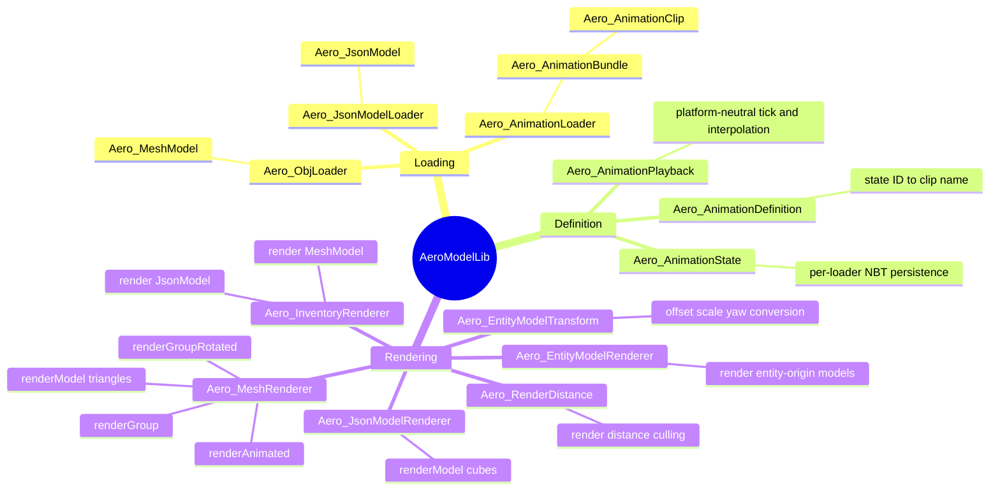
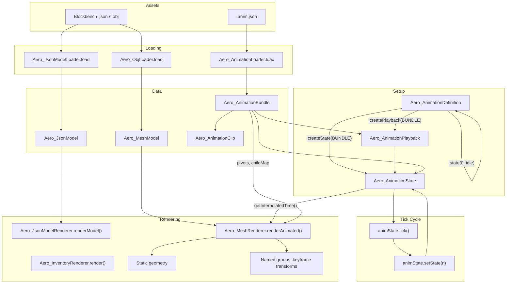
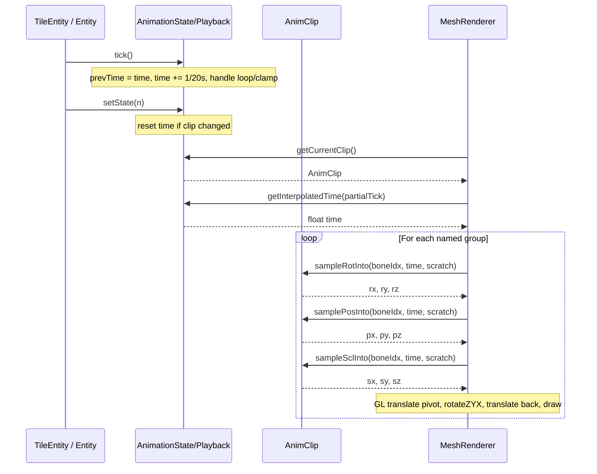
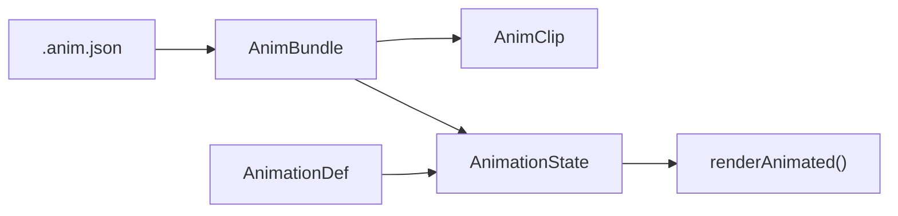
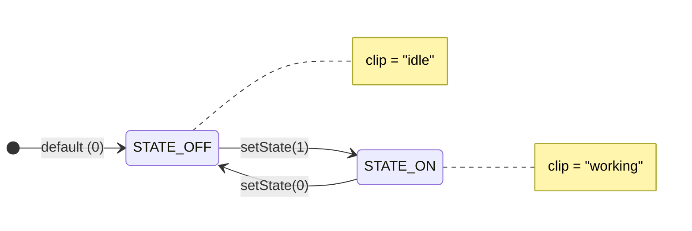
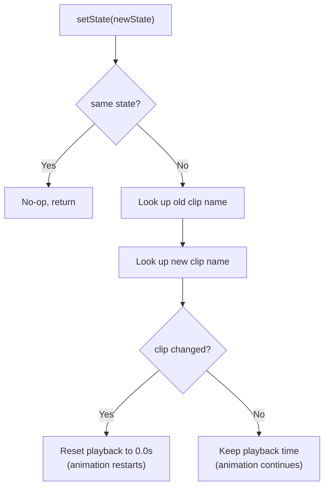
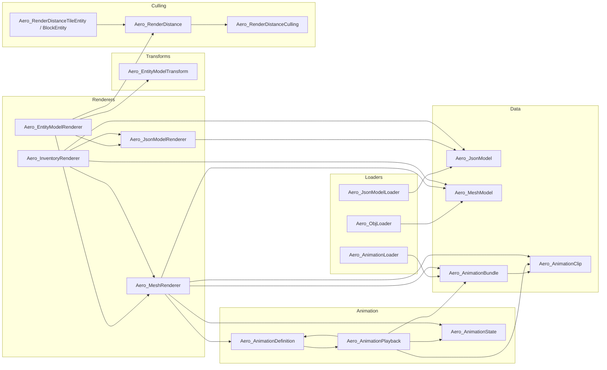

# AeroModelLib

> 3D rendering and animation library for Minecraft Beta 1.7.3 (RetroMCP/ModLoader and StationAPI).
> Like GeckoLib, but for Beta 1.7.3's OpenGL 1.1 pipeline.
> Author: lucasrgt - aerocoding.dev

**Compatibility:** Java 8 core/ModLoader | JDK 17 StationAPI build | Minecraft Beta 1.7.3 | RetroMCP | ModLoader/Forge 1.0.6 | StationAPI | LWJGL (OpenGL 1.1+)

---

## Table of Contents

1. [Quick Start](#1-quick-start)
2. [Architecture](#2-architecture)
3. [Static Models (Blockbench JSON)](#3-static-models-blockbench-json)
4. [OBJ Models (Mesh)](#4-obj-models-mesh)
5. [Animations](#5-animations)
6. [State Machine](#6-state-machine)
7. [Advanced Animation](#7-advanced-animation) — easings, transitions, keyframe events, multi-layer Stack, state router
8. [API Reference](#8-api-reference)
9. [File Formats](#9-file-formats)
10. [Asset Workflow & Converter](#10-asset-workflow--converter)
11. [Patterns & Best Practices](#11-patterns--best-practices) — incl. [Multiplayer](#multiplayer)
12. [Using with Entities (Mobs)](#12-using-with-entities-mobs)
13. [Troubleshooting](#13-troubleshooting)
14. [Full End-to-End Example](#14-full-end-to-end-example)
15. [Development, Tests & Benchmarks](#15-development-tests--benchmarks)

---

## What's new in v0.2.0

- **Quaternion slerp on rotation channels** with hybrid heuristic (slerp on
  segments where every axis delta is < 180°, euler-lerp fallback above —
  preserves v0.1 long-arc behavior for sloppy 2-keyframe full revolutions).
  Multi-axis poses now interpolate along the geodesic rotation path.
- **UV animation** — bones accept `uv_offset` / `uv_scale` channels. Renderer
  applies `u' = u * uScale + uOffset; v' = v * vScale + vOffset` per vertex.
  Identity transform fast-paths to the raw emit, so v0.1 bones pay zero cost.
- **Hierarchical rendering + skeletal IK (CCD)** — animated child bones now
  inherit every animated ancestor's transform via the `childMap` chain.
  `Aero_IkChain` interface + `Aero_CCDSolver` mutate intermediate bones to
  bring an end-effector close to a world target (foot planting, look-at).
  Hook is opt-in: callers without IK chains pay zero.
- **Morph targets** — schema bumped to `format_version "1.1"` (additively;
  v1.0 still loads). New `morph_targets` block declares OBJ variants with
  matching topology. `Aero_MorphState` carries weights with NBT save/restore.
  Renderer blends static-geometry vertices via per-vertex
  `final = base + Σ(weight × delta)`.
- **Animation graph** — DAG-style composition for animator-grade workflows.
  `Aero_AnimationGraph` + `Aero_GraphParams` + `Aero_GraphClipNode` /
  `Aero_GraphBlend1DNode` / `Aero_GraphAdditiveNode`. Coexists with the
  existing flat `Aero_AnimationStack` — Stack stays the lightweight option.

Schema/runtime backward compat: every existing `.anim.json`, OBJ, and
Blockbench `.bbmodel` from v0.1 loads and renders unchanged. The 9
v0.1 showcase blocks (Motor, Pump, Crystal, CrystalChaos, EasingShowcase
1/2/3, PlasmaCrystal, Robot) are visually identical because none of
their animated bones have animated ancestors — the hybrid hierarchy
collapses to flat rendering for them.

---

## 1. Quick Start

### Static model in 3 steps

```java
// 1. Load the model (static field — cached automatically)
public static final Aero_JsonModel MODEL = Aero_JsonModelLoader.load("/models/MyMachine.json");

// 2. In your TileEntitySpecialRenderer:
bindTextureByName("/block/my_texture.png");
float brightness = tileEntity.worldObj.getLightBrightness(x, y + 1, z);
Aero_JsonModelRenderer.renderModel(MODEL, d, d1, d2, 0f, brightness);

// 3. In your BlockRenderer (inventory):
Aero_InventoryRenderer.render(renderer, MODEL);
```

### Animated OBJ model in 5 steps

```java
// === TileEntity ===

// 1. Bundle the animation file + state map into an Aero_AnimationSpec.
public static final Aero_AnimationSpec ANIMATION =
    Aero_AnimationSpec.builder("/models/MyMachine.anim.json")
        .state(0, "idle")     // STATE_OFF
        .state(1, "working")  // STATE_ON
        .build();

// 2. Create per-instance state from the spec.
public final Aero_AnimationState animState = ANIMATION.createState();

// 3. In updateEntity():
animState.tick();                                       // ALWAYS first
ANIMATION.applyState(animState, isRunning ? 1 : 0);     // AFTER tick

// 4. In readFromNBT/writeToNBT:
animState.readFromNBT(nbt);
animState.writeToNBT(nbt);

// === TileEntitySpecialRenderer ===

// 5. Load OBJ and render — spec-aware overload reads bundle/def from the state.
public static final Aero_MeshModel MODEL = Aero_ObjLoader.load("/models/MyMachine.obj");

// In renderTileEntityAt():
bindTextureByName("/block/my_texture_hq.png");
Aero_MeshRenderer.renderAnimated(MODEL, tile.animState,
    d, d1, d2, brightness, partialTick);
```

The lower-level `(MODEL, BUNDLE, DEF, state)` overload is still public for
mods that compose bundles/definitions dynamically (procedural mobs, modular
machines, etc.).

### Entity model quick start

```java
// === Entity class ===
// MODEL on the entity so the ctor and renderer share the same culling
// values — single source of truth.
public static final Aero_ModelSpec MODEL =
    Aero_ModelSpec.mesh("/models/MyMob.obj")
        .texture("/mob/my_mob.png")
        .animations(Aero_AnimationSpec.builder("/models/MyMob.anim.json")
            .state(0, "idle").state(1, "walk").state(2, "attack")
            .defaultTransitionTicks(4)
            .build())
        .offset(-0.5f, 0f, -0.5f)
        .scale(1f)
        .cullingRadius(2f)
        .animatedDistance(48d)
        .maxRenderDistance(96f)
        .build();

public final Aero_AnimationState animState = MODEL.createState();

public MyMob(World world) {
    super(world);
    Aero_RenderDistance.applyEntityRenderDistance(this, MODEL);   // reads cullingRadius from spec
}

public void onLivingUpdate() {
    super.onLivingUpdate();
    animState.tick();
    MODEL.applyState(animState,
        isSwinging ? STATE_ATTACK : isMoving() ? STATE_WALK : STATE_IDLE);
}

// === Renderer ===
public void doRender(Entity entity, double x, double y, double z,
                     float yaw, float partialTick) {
    MyMob mob = (MyMob) entity;
    loadTexture(MODEL.getTexturePath());
    Aero_EntityModelRenderer.render(MODEL, mob.animState,
        entity, x, y, z, yaw, partialTick);
}
```

---

## 2. Architecture

### Mindmap



### Full pipeline



### Sequence diagram (per frame)



The Stack render overload uses `Aero_AnimationStack.samplePose(...)` once per
bone. That keeps rotation, position and scale composition consistent while
avoiding repeated layer traversal, clip lookup, interpolated-time reads and
bone-index lookups for each channel.

### Separation of concerns

| Layer | Classes | Responsibility |
|-------|---------|---------------|
| **Data (immutable)** | `Aero_JsonModel`, `Aero_MeshModel`, `Aero_AnimationBundle`, `Aero_AnimationClip` | Store loaded data. Thread-safe. Store as `static final`. |
| **Loading (cached)** | `Aero_JsonModelLoader`, `Aero_ObjLoader`, `Aero_AnimationLoader` | Read files from classpath, parse, cache by path with synchronized bounded LRU caches. |
| **Specs (declarative)** | `Aero_AnimationSpec`, `Aero_ModelSpec` | Bundle common integration wiring into reusable static declarations. |
| **Definition** | `Aero_AnimationDefinition` | Maps state IDs to clip names. One per machine/entity type. |
| **Playback (mutable)** | `Aero_AnimationPlayback` | Platform-neutral tick, setState, interpolation, clip cache. |
| **State (mutable)** | `Aero_AnimationState` | Loader-specific NBT wrapper around playback. |
| **Rendering** | `Aero_JsonModelRenderer`, `Aero_MeshRenderer`, `Aero_EntityModelRenderer`, `Aero_InventoryRenderer` | Static methods for OpenGL drawing. |
| **Transforms** | `Aero_EntityModelTransform` | Immutable offset/scale/yaw settings for entity-origin rendering. |
| **Culling** | `Aero_RenderDistance`, `Aero_RenderDistanceCulling`, `Aero_RenderDistanceTileEntity` / `Aero_RenderDistanceBlockEntity` | Keeps Aero renderers aligned with the player's render distance under a configurable cap instead of Beta's fixed 64-block special-render cutoff. |
| **LOD** | `Aero_RenderLod` | Chooses animated, static-at-rest or culled rendering from camera-relative distance. |

---

## 3. Static Models (Blockbench JSON)

### Workflow

1. **Blockbench:** File > Export > Export as JSON (`.json`)
2. **Save to:** `src/retronism/assets/models/MyMachine.json`
3. The transpiler copies it into the jar automatically

### Loading

```java
public static final Aero_JsonModel MODEL = Aero_JsonModelLoader.load("/models/MyMachine.json");
```

- Automatically cached by path
- Returns an immutable `Aero_JsonModel`

### World rendering

```java
// In TileEntitySpecialRenderer.renderTileEntityAt():
bindTextureByName("/block/my_texture.png");
float brightness = world.getLightBrightness(x, y + 1, z);
Aero_JsonModelRenderer.renderModel(MODEL, d, d1, d2, rotation, brightness);
```

**Parameters:**
- `d, d1, d2` — tile entity position (from renderTileEntityAt)
- `rotation` — Y rotation in degrees (0, 90, 180, 270). Rotates around block center
- `brightness` — 0.0-1.0, from `getLightBrightness()`

### Inventory rendering

```java
// In BlockRenderer.renderInventory():
int texID = ModLoader.getMinecraftInstance().renderEngine.getTexture("/block/my_texture.png");
ModLoader.getMinecraftInstance().renderEngine.bindTexture(texID);
Aero_InventoryRenderer.render(renderer, MODEL);
```

Auto-scales to fit the slot and centers at origin. The caller (RenderItem) already applies isometric rotation.

### Internal format (Aero_JsonModel)

Each element is a `float[30]`:

| Indices | Content |
|---------|---------|
| `[0-2]` | min position (x, y, z) in Blockbench units |
| `[3-5]` | max position (x, y, z) in Blockbench units |
| `[6-9]` | UV face DOWN (u1, v1, u2, v2) |
| `[10-13]` | UV face UP |
| `[14-17]` | UV face NORTH |
| `[18-21]` | UV face SOUTH |
| `[22-25]` | UV face WEST |
| `[26-29]` | UV face EAST |

At construction time, `Aero_JsonModel` also pre-bakes render quads into `quadsByFace[6]`.
Renderers consume those packed quads directly, so per-frame JSON rendering does not rebuild
scaled coordinates or UVs from the raw `elements` array.

UV = `-1` means missing face (renderer skips it).

---

## 4. OBJ Models (Mesh)

### Workflow

1. **Blockbench:** File > Export > Export OBJ Model (`.obj`)
2. **Save to:** `src/retronism/assets/models/MyMachine.obj` (only the .obj, .mtl is not used)
3. The transpiler copies it into the jar automatically

### Animated parts in OBJ

Use `o` or `g` directives in the OBJ to separate animated parts:

```obj
# Static geometry (unnamed = goes into main array)
v ...
f ...

# Animated part: turbine
o turbine_l
v ...
f ...

# Another animated part: shredder
o shredder_L
v ...
f ...
```

- Triangles **without** `o`/`g` group → static geometry
- Triangles **with** group → stored separately in `namedGroups`
- `renderModel()` draws only static geometry
- `renderAnimated()` draws everything (static + animated groups with transforms)

### Loading

```java
public static final Aero_MeshModel MODEL = Aero_ObjLoader.load("/models/MyMachine.obj");
```

### Brightness classification

During parsing, each triangle is classified into 1 of 4 groups by face normal:

| Group | Condition | Brightness factor |
|-------|-----------|-------------------|
| `GROUP_TOP` (0) | dominant +Y normal | 1.0 |
| `GROUP_BOTTOM` (1) | dominant -Y normal | 0.5 |
| `GROUP_NS` (2) | dominant Z normal | 0.8 |
| `GROUP_EW` (3) | dominant X normal | 0.6 |

This reduces `setColorOpaque_F` calls from O(N triangles) to 4 per frame.

### Rendering

#### Static (flat lighting)
```java
Aero_MeshRenderer.renderModel(MODEL, x, y, z, rotation, brightness);
```

#### Static (smooth lighting)
```java
Aero_MeshRenderer.renderModel(MODEL, x, y, z, rotation, world, originX, topY, originZ);
```
Bilinear light sampling at each triangle's centroid XZ position.

#### Individual group (manual GL control)
```java
// No push/pop — you control the GL state
GL11.glPushMatrix();
GL11.glTranslated(x, y, z);
// ... your transforms ...
Aero_MeshRenderer.renderGroup(MODEL, "fan", brightness);
GL11.glPopMatrix();
```

#### Group with pivot rotation
```java
float angle = tile.fanAngle + (tile.isActive ? 18f * partialTick : 0f);
Aero_MeshRenderer.renderGroupRotated(MODEL, "fan",
    d + ox, d1 + oy, d2 + oz, brightness,
    pivotX, pivotY, pivotZ,    // pivot in block units
    angle, 0f, 1f, 0f);       // angle + Y axis
```

#### Inventory
```java
Aero_InventoryRenderer.render(renderer, MODEL);
```

---

## 5. Animations

### Overview

The animation system is inspired by GeckoLib/Bedrock, adapted for Beta 1.7.3's OpenGL 1.1 pipeline.



### .anim.json format

```json
{
  "format_version": "1.0",
  "pivots": {
    "fan": [24.0, 44.5, 47.0]
  },
  "childMap": {
    "fan_blade_0": "fan",
    "fan_blade_1": "fan"
  },
  "animations": {
    "working": {
      "loop": "loop",
      "length": 2.0,
      "bones": {
        "fan": {
          "rotation": {
            "0": { "value": [   0, 0, 0], "interp": "linear" },
            "1": { "value": [-360, 0, 0], "interp": "linear" },
            "2": { "value": [-720, 0, 0], "interp": "linear" }
          },
          "position": {
            "0": { "value": [0, 0, 0], "interp": "linear" }
          }
        }
      }
    }
  }
}
```

**Units:**
- **Pivots:** Blockbench pixels (automatically divided by 16 in the loader → block units)
- **Rotation:** Euler degrees [X, Y, Z], applied in **Z → Y → X** order (Bedrock/GeckoLib compatible)
- **Position:** Blockbench pixels (divided by 16 in the renderer → block units)
- **Time:** seconds (float)

### .anim.json sections

#### `pivots`
Rotation pivot for each bone. **Required** for bones that rotate.

```json
"pivots": {
  "turbine_l": [2.5, 24, 24],
  "shredder_L": [19, 50, 24]
}
```

Bones without a pivot default to `[0, 0, 0]`.

#### `childMap`
Hierarchy mapping between OBJ groups and animated bones.

```json
"childMap": {
  "turbine_l_blade_0": "turbine_l",
  "shred_blade_L_0_0": "shredder_L"
}
```

When the renderer encounters an OBJ group (e.g. `turbine_l_blade_0`) with no direct bone in the clip:
1. Looks up `childMap` → finds parent `turbine_l`
2. Uses the parent bone's transforms
3. If the parent also has no bone, walks up one level (grandparent)
4. If nothing found via childMap, falls back to **prefix matching** (e.g. `turbine_l_blade_0` → `turbine_l`)

#### `animations`
Each clip has:
- `loop` (string): `"loop"`, `"play_once"` or `"hold_on_last_frame"`
- `length` (float): duration in seconds
- `bones`: map of bone → channels (rotation, position)

Each pose keyframe is a `"time": {"value": [x, y, z], "interp": "..."}` object.

### Loading

```java
public static final Aero_AnimationBundle BUNDLE = Aero_AnimationLoader.load("/models/MyMachine.anim.json");
```

### Defining states

```java
public static final int STATE_OFF = 0;  // Convention: 0 = off
public static final int STATE_ON  = 1;

public static final Aero_AnimationDefinition ANIM_DEF = new Aero_AnimationDefinition()
    .state(STATE_OFF, "idle")
    .state(STATE_ON,  "working");
```

- Builder pattern (chain `.state()` calls)
- `STATE_OFF` should be 0 (NBT default when key is absent)
- Clip names must exist in the `.anim.json`

### Creating per-instance state

```java
public final Aero_AnimationState animState = ANIM_DEF.createState(BUNDLE);
```

- **One per instance** (instance field, not static)
- Created via `AnimationDef.createState(bundle)`

### Tick cycle

```
updateEntity() {
    animState.tick();                          // 1. Advance 1/20s
    animState.setState(running ? 1 : 0);       // 2. Change state if needed
}
```

**CRITICAL:** `tick()` BEFORE `setState()`. Order matters for correct interpolation.

#### What `tick()` does:
1. Saves `prevPlaybackTime` (for inter-frame interpolation)
2. Advances `playbackTime += 1/20`
3. If looping: wraps at clip end (modulo)
4. If not looping: clamps at clip end

#### What `setState()` does:
1. If state unchanged: no-op
2. If clip changed: resets `playbackTime = 0`

### NBT persistence

```java
public void writeToNBT(NBTTagCompound nbt) {
    super.writeToNBT(nbt);
    animState.writeToNBT(nbt);  // Saves "Anim_state" and "Anim_time"
}

public void readFromNBT(NBTTagCompound nbt) {
    super.readFromNBT(nbt);
    animState.readFromNBT(nbt);  // Restores state and time
}
```

NBT keys:
- `"Anim_state"` — int (state ID)
- `"Anim_time"` — float (time in seconds)

### Rendering full animation

```java
Aero_MeshRenderer.renderAnimated(
    MODEL,                          // OBJ model with named groups
    Tile.BUNDLE,                    // animation data
    Tile.ANIM_DEF,                  // state->clip mapping
    tile.animState,                 // per-instance playback
    d + offsetX, d1 + offsetY, d2 + offsetZ,  // world position
    brightness,                     // 0.0-1.0
    partialTick                     // tick fraction (0.0-1.0)
);
```

This method:
1. Renders static geometry once with the animated groups in one shared GL state block
2. For each named group in the OBJ:
   - Resolves the bone (direct → childMap → prefix fallback)
   - Samples rotation, position and scale at interpolated time without per-frame allocations
   - Applies GL transform: translate(pivot + offset) → rotateZ → rotateY → rotateX → translate(-pivot)
   - Draws the group's triangles

### Sequence diagram (per frame)

See the [Architecture section](#sequence-diagram-per-frame) for the full Mermaid sequence diagram.

---

## 6. State Machine

### Overview

The animation system includes a built-in **state machine** that manages
transitions between animation clips. State changes are immediate by default,
with optional transition ticks for clips that should visually crossfade.



### Components

| Class | Role | Lifecycle |
|-------|------|-----------|
| `Aero_AnimationSpec` | Declarative bundle + state map | `static final`, one per model family |
| `Aero_AnimationDefinition` | Maps state IDs → clip names (blueprint) | `static final`, one per machine/entity type |
| `Aero_AnimationPlayback` | Shared playback engine: tick, setState, interpolation, clip cache | One per animated instance when no Minecraft NBT adapter is needed |
| `Aero_AnimationState` | Loader-specific playback + NBT adapter | Instance field, one per TileEntity/Entity |

### Defining states

```java
public static final int STATE_OFF  = 0;  // Convention: 0 = off/idle
public static final int STATE_ON   = 1;
public static final int STATE_FAST = 2;

public static final Aero_AnimationDefinition ANIM_DEF = new Aero_AnimationDefinition()
    .state(STATE_OFF,  "idle")
    .state(STATE_ON,   "working")
    .state(STATE_FAST, "working_fast");
```

- State IDs are non-negative integers (0, 1, 2, ...)
- Convention: `0` = off/idle (NBT default when key is absent)
- Internally stored as a sparse array — IDs don't need to be sequential
- Multiple states **can** map to the same clip name

### Transition behavior

When `setState(newState)` is called:



Key behaviors:
- **Same state** → no-op (calling `setState(1)` while already in state 1 does nothing)
- **Different state, different clip** → playback resets to 0 (new animation starts from beginning)
- **Different state, same clip** → playback continues (useful for semantic states that share an animation)

### Default transition behavior

`setState(...)` switches immediately. Use `setStateWithTransition(state, ticks)`
or `Aero_AnimationStateRouter.withTransition(ticks)` when the visual should
crossfade between clips.

### Edge cases

| Scenario | Behavior |
|----------|----------|
| Unknown state ID (not registered) | `getCurrentState()` updates, clip resolves to `null` → animation stops |
| Negative state ID | `getClipName()` returns `null` → same as unknown |
| Clip name not in `.anim.json` | `getCurrentClip()` returns `null` → renderer skips animation |
| `tick()` with null clip | Playback time resets to `0.0` → safe no-op |

### Multiple states, same clip

```java
// Both "overdrive" states use the same fast animation
public static final Aero_AnimationDefinition ANIM_DEF = new Aero_AnimationDefinition()
    .state(0, "idle")
    .state(1, "working")
    .state(2, "working")   // same clip as state 1
    .state(3, "overdrive");
```

Switching between state 1 and 2 **does not** reset the animation — the clip is the same so playback continues uninterrupted. The state ID still changes, so your logic can distinguish them.

### Loop boundary handling

For looping clips, the state machine handles the wrap-around correctly during partial-tick interpolation:

- When `playbackTime` wraps (resets past clip end), the interpolation detects `current < previous`
- It extends the current time past `clip.length` to interpolate smoothly across the boundary
- Then applies modulo to bring back into range
- Result: **no visible stutter** at loop boundaries

### Integration with tick cycle

```java
public void updateEntity() {
    animState.tick();                              // 1. Advance time
    animState.setState(isRunning ? 1 : 0);         // 2. Evaluate state
}
```

**Order matters:** `tick()` saves `prevPlaybackTime` for interpolation. If `setState()` is called first, a clip change would reset time before `tick()` saves it, causing interpolation artifacts on the transition frame.

---

## 7. Advanced Animation

These features extend the basic state machine with finer-grained control
over how clips look and behave. Every section below is **opt-in** — clips
authored without any of this still load and play identically. Mods can
adopt one feature at a time as the visuals demand it.

### Easing curves

Each keyframe stores an `interp` mode that controls the segment ENDING at
that keyframe. The default is `linear`; the lib also ships `step` (snap)
and `catmullrom` (cubic spline through neighbours) plus 30 GeckoLib-style
easing curves grouped into 10 families, each with `easeIn*` / `easeOut*`
/ `easeInOut*` variants:

| Family | Visual signature |
|--------|------------------|
| `sine`     | Smooth quarter-period accel/decel |
| `quad`     | t² — gentle parabolic ramp |
| `cubic`    | t³ — sharper than quad |
| `quart`    | t⁴ |
| `quint`    | t⁵ — almost a step at the start |
| `expo`     | 2^(10·t) — explosive |
| `circ`     | √(1−(1−t)²) — fast-then-flat (or mirror) |
| `back`     | Overshoots past the target before settling |
| `elastic`  | Springs back and forth around the target |
| `bounce`   | Piecewise parabolas — bouncing ball |

Lookup by name lives in `Aero_Easing.fromName(String)`; unknown names throw
at load time so typos are caught early. Constants like
`Aero_Easing.EASE_OUT_BACK` are also available for code-side authoring.

```json
"rotation": {
  "0":   { "value": [0, 0, 0], "interp": "linear" },
  "0.5": { "value": [0, 90, 0], "interp": "easeOutQuint" },
  "1.0": { "value": [0, 0, 0], "interp": "easeInBack" }
}
```

Every easing satisfies `f(0) = 0` and `f(1) = 1` exactly so keyframe
boundaries stay continuous. `back` overshoots above 1 mid-curve, `elastic`
oscillates above and below, `bounce` clamps at 1 between sub-bounces.

### Rotation slerp (since v0.2.0)

Rotation channels interpolate via spherical linear interpolation
(quaternion slerp) on segments where every euler axis delta between
adjacent keyframes is **strictly less than 180°**. Beyond that the
heuristic falls back to euler-lerp (the v0.1 behavior) — see below.

This gives the visually smoother geodesic path on the rotation sphere
for normal animation segments and avoids gimbal-style stutter when
multiple axes rotate simultaneously. Position and scale channels are
unaffected — they still linear-lerp.

**Long-arc fallback.** Slerp interprets a `0→360` Y rotation as "stay at
0" because both endpoints are the same orientation in quaternion space.
The lib detects this and falls through to euler-lerp on any segment
where any axis delta `|b - a| ≥ 180°`, so a 2-keyframe full revolution
behaves the same as it did in v0.1. If you need slerp to handle a long
rotation, split it across multiple keyframes (`0→120→240→360`) — each
segment under 180° will slerp.

**`catmullrom` on rotation.** Demoted to LINEAR-eased slerp on
short-arc segments (no spherical Catmull-Rom — squad's complexity isn't
worth the marginal benefit on rotation curves where slerp is already
smooth). Long-arc segments retain euler Catmull-Rom.

### Loop types

`Aero_AnimationLoop` controls what happens when playback reaches the clip
length. The schema accepts the lowercase string form below.

| Enum | JSON | Behavior |
|------|------|----------|
| `Aero_AnimationLoop.LOOP` | `"loop"` | Wrap to 0 and keep playing |
| `Aero_AnimationLoop.PLAY_ONCE` | `"play_once"` | Clamp at length; `state.isFinished()` flips to `true` |
| `Aero_AnimationLoop.HOLD_ON_LAST_FRAME` | `"hold_on_last_frame"` | Clamp at length; `state.isFinished()` stays `false` |

PLAY_ONCE and HOLD render identically (both freeze at the final pose);
the difference is signalling. PLAY_ONCE tells callers "I'm done — chain
me into the next clip"; HOLD tells callers "I'm holding this pose until
you say otherwise". Use `state.isFinished()` to drive a sequence:

```java
animState.tick();
if (animState.isFinished()) {
    animState.setState(NEXT_STATE);
}
```

### Smooth state transitions

`Aero_AnimationPlayback.setStateWithTransition(stateId, ticks)` snapshots
the active clip's pose at the moment of the call, switches state, and
blends from the snapshot toward the new clip's start over the next
`ticks` game ticks. For each bone:

- Present in BOTH clips → linear lerp from snapshot to new sample
- Present only in NEW clip → starts at full strength (no fade-in pop)
- Present only in OLD clip → fades to identity over the transition

Introspection helpers: `inTransition()` and `getTransitionAlpha(partialTick)`
return whether a blend is in progress and the current 0..1 ratio.

```java
animState.setStateWithTransition(STATE_WALK, 6);   // 6-tick blend
```

Pair the router below with `withTransition(N)` to make every state change
in the entity smooth without sprinkling these calls through tick code.

### Non-pose keyframe events

Clips can declare events alongside the rotation/position/scale tracks.
Each event has a channel (free-form string), a payload, and an optional
locator (a bone name). The lib delivers them through
`Aero_AnimationEventListener` whenever playback crosses the keyframe's
timestamp, including across loop wraps.

```json
"keyframes": {
  "sound":    { "0.5": { "name": "random.click",   "locator": "fan" } },
  "particle": { "1.0": { "name": "smoke",        "locator": "exhaust" } },
  "custom":   { "0.0": { "name": "CYCLE_START" } }
}
```

Schema notes:

- **Channel** is the parent key. `sound`, `particle`, `custom` are
  conventional but not enforced — listeners can route any string.
- **Value** must be `{"name": "...", "locator": "..."}`. The bare-string
  shorthand is no longer accepted.
- **Locator** is optional; omit it for clip-relative events.

The lib stays platform-neutral — it does not call `world.playSound` or
`world.addParticle` itself. Each consumer routes the channel + payload
through its own dispatch:

```java
animState.setEventListener((channel, data, locator, time) -> {
    if (world == null) return;
    double cx = x + 0.5, cy = y + 0.5, cz = z + 0.5;
    if (locator != null) {
        float[] p = new float[3];
        if (animState.getAnimatedPivot(locator, 0f, p)) {
            cx = x + p[0]; cy = y + p[1]; cz = z + p[2];
        }
    }
    if      ("sound".equals(channel))    world.playSound(cx, cy, cz, data, 0.6f, 1.0f);
    else if ("particle".equals(channel)) world.addParticle(data, cx, cy, cz, 0, 0.05, 0);
    // "custom" is gameplay — toggle a hitbox, schedule damage, etc.
});
```

`getAnimatedPivot(boneName, partialTick, out)` returns the bone's bundle
pivot plus the position-channel offset at the current playback time —
i.e. "where the bone is RIGHT NOW", not where it was authored. Rotation
and scale don't move a single point so they stay out of the calculation;
for the tip of a swinging blade, declare a separate bone at the tip and
locate the event there.

**Loop-wrap safety:** events at exactly `t = 0` fire each cycle (the
post-wrap leg of the firing window is half-open `[0, now]`); events
elsewhere fire exactly once per crossing.

### Multi-layer playback (Stack)

`Aero_AnimationStack` runs several `Aero_AnimationPlayback` instances
together, combining their per-bone outputs into a single pose for the
renderer. Layers are sampled in insertion order; each declares whether
it composes by REPLACE (default) or by ADD.

```java
Aero_AnimationStack stack = Aero_AnimationStack.builder()
    .replace(walkPlayback)                         // base
    .additive(headTrackPlayback, 0.8f)              // overlay
    .build();

stack.tick();    // ticks every layer's playback
Aero_MeshRenderer.renderAnimated(MODEL, stack, x, y, z, brightness, partialTick);
```

| Mode | Rotation/Position | Scale |
|------|-------------------|-------|
| Replace (default) | `lerp(running, sample, weight)` | `lerp(running, sample, weight)` |
| Additive | `running + sample × weight` | `running × (1 + (sample − 1) × weight)` |

Scale composes multiplicatively in additive mode so two `1.5×` layers
combine to `2.25×` instead of `3.0×`. `weight` is always 0..1 and acts
like an opacity slider for the layer's contribution.

Bones absent from a layer's clip are passed through unchanged — a
secondary layer that animates only the head bone has zero effect on
legs / arms / etc.

### Predicate state router

`Aero_AnimationStateRouter` collapses the typical "if attacking →
STATE_ATTACK; else if walking → STATE_WALK; else IDLE" cascade into a
declarative chain. Rules evaluate top-down in insertion order; the first
matching predicate wins.

```java
Aero_AnimationStateRouter router = new Aero_AnimationStateRouter()
    .when(p -> entity.isDead(),       STATE_DEATH)
    .when(p -> entity.isAttacking(),  STATE_ATTACK)
    .when(p -> entity.isMoving(),     STATE_WALK)
    .otherwise(STATE_IDLE)
    .withTransition(6);

router.applyTo(animState);   // call each tick
```

`otherwise(stateId)` is optional — without it, a tick where no rule
matches leaves the playback's current state untouched.
`withTransition(ticks)` routes through `setStateWithTransition` so every
state change is a smooth blend rather than a snap.

The `Aero_AnimationPredicate` interface receives the playback being
routed, so rules can inspect things like `playback.isFinished()` to chain
non-loop clips automatically.

---

## 8. API Reference

### Aero_JsonModel

Cube-based model container (Blockbench JSON).

| Field | Type | Description |
|-------|------|-------------|
| `name` | `String` | Model identifier |
| `elements` | `float[][]` | Array of cubes, each float[30] |
| `textureSize` | `float` | Texture resolution (default 128) |
| `scale` | `float` | Scale factor (default 16 = 1 block) |
| `invTextureSize` | `float` | Cached reciprocal used by pre-baked UVs |
| `invScale` | `float` | Cached reciprocal used by render/bounds paths |
| `quadsByFace` | `float[][][]` | Pre-baked packed quads grouped by face direction |

| Constructor | Description |
|-------------|-------------|
| `Aero_JsonModel(name, elements, textureSize, scale)` | Full constructor |
| `Aero_JsonModel(name, elements)` | textureSize=128, scale=16 |

---

### Aero_MeshModel

Triangulated model container (OBJ).

| Field | Type | Description |
|-------|------|-------------|
| `name` | `String` | Identifier |
| `scale` | `float` | Scale factor (default 1.0) |
| `invScale` | `float` | Cached reciprocal scale |
| `groups` | `float[][][]` | Static triangles per brightness group [4][N][15] |
| `namedGroups` | `Map<String, float[][][]>` | Animated parts, same 4-group structure |

| Constant | Value | Brightness |
|----------|-------|------------|
| `GROUP_TOP` | 0 | 1.0 |
| `GROUP_BOTTOM` | 1 | 0.5 |
| `GROUP_NS` | 2 | 0.8 |
| `GROUP_EW` | 3 | 0.6 |

| Method | Returns | Description |
|--------|---------|-------------|
| `triangleCount()` | `int` | Total triangles in static geometry |
| `triangleCountForGroup(name)` | `int` | Total triangles in a named group (0 if not found) |
| `getNamedGroup(name)` | `float[][][]` | Named group buckets, or `null` |
| `getBounds()` | `float[6]` | Cached AABB in block units |
| `getStaticSmoothLightData()` | `SmoothLightData` | Cached XZ footprint and triangle centroids for smooth lighting |

---

### Aero_AnimationBundle

Immutable container with animation data loaded from `.anim.json`.

| Field | Type | Description |
|-------|------|-------------|
| `clips` | `Map<String, Aero_AnimationClip>` | Clips indexed by name |
| `pivots` | `Map<String, float[]>` | Pivots in block units (already divided by 16) |
| `childMap` | `Map<String, String>` | childName → parentBoneName |

| Method | Returns | Description |
|--------|---------|-------------|
| `getClip(name)` | `Aero_AnimationClip` | Clip by name, or `null` |
| `hasPivot(boneName)` | `boolean` | `true` if a pivot is registered for this bone |
| `getPivotInto(boneName, out)` | `boolean` | Fills `out[0..2]` with the pivot in block units; returns `false` and leaves `out` untouched on a miss |
| `getParentBoneName(childName)` | `String` | Parent bone from childMap, or `null` |

---

### Aero_AnimationClip

Immutable animation clip data with keyframes plus optional non-pose
events. Constructed by the loader or by `Aero_AnimationClip.builder(...)`
for tests and procedurally-generated animations.

| Field | Type | Description |
|-------|------|-------------|
| `name` | `String` | Clip name |
| `loop` | `Aero_AnimationLoop` | `LOOP` / `PLAY_ONCE` / `HOLD_ON_LAST_FRAME` |
| `length` | `float` | Duration in seconds |

| Method | Returns | Description |
|--------|---------|-------------|
| `indexOfBone(name)` | `int` | Bone index, or `-1` |
| `hasEvents()` | `boolean` | True if the clip carries non-pose keyframe events |
| `sampleRotInto(boneIdx, time, out)` | `boolean` | Allocation-free rotation sampler |
| `samplePosInto(boneIdx, time, out)` | `boolean` | Allocation-free position sampler |
| `sampleSclInto(boneIdx, time, out)` | `boolean` | Allocation-free scale sampler |

Builder usage (rarely needed — the loader is the standard path):

```java
Aero_AnimationClip clip = Aero_AnimationClip.builder("spin")
    .loop(Aero_AnimationLoop.LOOP)
    .length(1f)
    .bone("fan")
        .rotation(
            new float[]{0f, 1f},
            new float[][]{{0f, 0f, 0f}, {0f, 360f, 0f}},
            new Aero_Easing[]{Aero_Easing.LINEAR, Aero_Easing.LINEAR})
        .endBone()
    .event(0.5f, "sound", "random.click", "fan")
    .build();
```

Interpolation routes through `Aero_Easing.apply(alpha)` plus a single
linear lerp; `STEP` and `CATMULLROM` keep their own paths. Sampling uses
binary search and clamps outside keyframe bounds.

---

### Aero_AnimationSpec

Declarative animation contract: one bundle plus one state definition. Store it
as `static final` on the entity/tile type, then create per-instance playback
from the spec.

| Method | Returns | Description |
|--------|---------|-------------|
| `builder(animationPath)` | `Builder` | Loads the `.anim.json` when built |
| `builder(bundle)` | `Builder` | Uses an already-loaded bundle |
| `state(stateId, clipName)` | `Builder` | Adds a state mapping |
| `definition(def)` | `Builder` | Uses an explicit `Aero_AnimationDefinition` |
| `defaultTransitionTicks(n)` | `Builder` | Default crossfade applied by `applyState`; `0` = snap |
| `createPlayback()` | `Aero_AnimationPlayback` | Platform-neutral playback |
| `createState()` | `Aero_AnimationState` | Loader-specific NBT-aware state |
| `createState(prefix)` | `Aero_AnimationState` | Same, with a custom NBT key prefix |
| `applyState(playback, stateId)` | `void` | Updates the playback honoring `defaultTransitionTicks` |
| `applyState(playback, router)` | `void` | Runs an `Aero_AnimationStateRouter`; uses `defaultTransitionTicks` when the router itself didn't declare one |

```java
public static final Aero_AnimationSpec ANIMATION =
    Aero_AnimationSpec.builder("/models/MyMob.anim.json")
        .state(0, "idle")
        .state(1, "walk")
        .defaultTransitionTicks(6)
        .build();

public final Aero_AnimationState animState = ANIMATION.createState();

// In tick():
ANIMATION.applyState(animState, isWalking ? 1 : 0);   // 6-tick blend, no manual transition arg
```

---

### Aero_AnimationDefinition

State ID → clip name mapping. One per machine/entity type.

| Method | Returns | Description |
|--------|---------|-------------|
| `builder().state(...).build()` | `Aero_AnimationDefinition` | Immutable-style builder for declarations |
| `state(stateId, clipName)` | `this` | Associates state with clip (builder pattern) |
| `getClipName(stateId)` | `String` | Clip name, or `null` |
| `createPlayback(bundle)` | `Aero_AnimationPlayback` | Creates platform-neutral playback (tests/tools) |
| `createState(bundle)` | `Aero_AnimationState` | Creates state for an instance |

---

### Aero_AnimationPlayback

Platform-neutral mutable playback state used by both ModLoader and StationAPI.

| Method | Returns | Description |
|--------|---------|-------------|
| `tick()` | `void` | Advances 1/20s. Call BEFORE setState() |
| `setState(stateId)` | `void` | Changes state. Resets time if clip changed. Call AFTER tick() |
| `setStateWithTransition(stateId, ticks)` | `void` | Same as setState but snapshots the previous pose and blends into the new clip over N ticks |
| `inTransition()` | `boolean` | True while a transition blend is still in progress |
| `getTransitionAlpha(partialTick)` | `float` | 0 = full snapshot, 1 = full new clip |
| `isFinished()` | `boolean` | True only for PLAY_ONCE clips that have reached their end |
| `setEventListener(listener)` | `void` | Registers a handler for non-pose keyframe events |
| `getAnimatedPivot(boneName, partialTick, out)` | `boolean` | Resolves a locator to its CURRENT animated pivot (rest pivot + position offset) |
| `sampleRotBlended/PosBlended/SclBlended(clip, idx, name, t, partial, out)` | `boolean` | Pose sampler with automatic transition fade — used by the Stack renderer |
| `getInterpolatedTime(partialTick)` | `float` | Smoothed time between ticks (for renderer) |
| `getCurrentClip()` | `Aero_AnimationClip` | Active clip, or `null` |
| `getBundle()` | `Aero_AnimationBundle` | Linked bundle |
| `getDef()` | `Aero_AnimationDefinition` | Linked def |
| `getCurrentState()` | `int` | Current state ID |

---

### Aero_AnimationState

Mutable per-instance animation state. Extends `Aero_AnimationPlayback` and adds the loader-specific NBT adapter.

| Method | Returns | Description |
|--------|---------|-------------|
| `writeToNBT(nbt)` | `void` | Saves `<prefix>state` and `<prefix>time` (default prefix `Anim_`) |
| `readFromNBT(nbt)` | `void` | Restores (prev=current to avoid first-frame jump) |
| `DEFAULT_NBT_KEY_PREFIX` | `String` | `"Anim_"` — public constant for callers that compose keys |

Use `def.createState(bundle, "Arm_")` (or `spec.createState("Arm_")`) to
override the prefix when one tile entity carries multiple
`Aero_AnimationState`s that would otherwise collide on `"Anim_state"`.

---

### Aero_JsonModelLoader

Loads Blockbench JSON models from classpath.

| Method | Returns | Description |
|--------|---------|-------------|
| `load(resourcePath)` | `Aero_JsonModel` | Loads and caches |
| `load(resourcePath, name)` | `Aero_JsonModel` | Loads with explicit name |
| `clearCache()` | `void` | Drops every cached JSON model |

Loader caches are synchronized and bounded to 512 entries by default.
Override with `-Daero.modellib.cache.maxEntries=N` if a tooling workflow needs
a different cap. A value of `0` disables eviction, which is useful only for
controlled tooling runs.

**Export:** Blockbench > File > Export > Export as JSON

---

### Aero_ObjLoader

Loads OBJ models from classpath.

| Method | Returns | Description |
|--------|---------|-------------|
| `load(resourcePath)` | `Aero_MeshModel` | Loads and caches |
| `load(resourcePath, name)` | `Aero_MeshModel` | Loads with explicit name |
| `clearCache()` | `void` | Drops every cached OBJ model |

Loader caches are synchronized and bounded to 512 entries by default.
Override with `-Daero.modellib.cache.maxEntries=N` if a tooling workflow needs
a different cap. A value of `0` disables eviction.

**Export:** Blockbench > File > Export > Export OBJ Model (only .obj, .mtl ignored)

**Supported:** `v`, `vt`, `vn` (ignored), `f` (tri/quad, fan triangulation), `o`/`g` (named groups), negative indices.

**UV:** Automatic V-flip (OBJ V=0 at bottom → Minecraft V=0 at top).

---

### Aero_AnimationLoader

Loads `.anim.json` from classpath.

| Method | Returns | Description |
|--------|---------|-------------|
| `load(resourcePath)` | `Aero_AnimationBundle` | Loads and caches |
| `clearCache()` | `void` | Drops every cached bundle |
| `SUPPORTED_FORMAT_VERSION` | `String` | The schema version this loader accepts (`"1.0"`) |

Loader caches are synchronized and bounded to 512 entries by default.
Override with `-Daero.modellib.cache.maxEntries=N` if a tooling workflow needs
a different cap. A value of `0` disables eviction.

The loader rejects any `.anim.json` that omits `format_version` or
declares one other than `SUPPORTED_FORMAT_VERSION`, so unknown schemas
fail fast instead of partially parsing. Built-in JSON parser (recursive
descent). No external dependencies.

---

### Aero_JsonModelRenderer

Renders `Aero_JsonModel` (cubes) with OpenGL.

| Method | Parameters | Description |
|--------|------------|-------------|
| `renderModel(model, x, y, z, rotation, brightness)` | `Aero_JsonModel`, position, Y rotation degrees, brightness 0-1 | World render |

**Per-face brightness:** Top=1.0, Bottom=0.5, N/S=0.8, E/W=0.6 (hardcoded, matches MeshModel).

---

### Aero_MeshRenderer

Renders `Aero_MeshModel` (OBJ triangles) with OpenGL.

| Method | Description |
|--------|-------------|
| `renderModel(model, x, y, z, rotation, brightness)` | Static geometry, flat lighting |
| `renderModelAtRest(model, x, y, z, rotation, brightness)` | Static geometry plus named groups at rest pose; useful for distant animation LOD |
| `renderModel(model, x, y, z, rotation, world, ox, topY, oz)` | Static geometry, smooth lighting (bilinear) |
| `renderGroup(model, groupName, brightness)` | Named group, NO push/pop (caller controls GL) |
| `renderGroupRotated(model, groupName, x, y, z, brightness, pivotX/Y/Z, angle, axisX/Y/Z)` | Group with pivot rotation |
| `renderAnimated(model, bundle, def, state, x, y, z, brightness, partialTick)` | Full keyframe-animated render |
| `renderAnimated(model, bundle, def, playback, x, y, z, brightness, partialTick)` | Same renderer with platform-neutral `Aero_AnimationPlayback` |
| `renderAnimated(model, playback, x, y, z, brightness, partialTick)` | Short form; playback already owns its definition and bundle |
| `renderAnimated(model, stack, x, y, z, brightness, partialTick)` | Multi-layer stack render path, shared by ModLoader and StationAPI |
| `..., Aero_RenderOptions options` | Mesh overloads accept explicit per-call styling such as tint |

---

### Aero_EntityModelRenderer

Entity-specific renderer wrapper for `Render` / `EntityRenderer` implementations. It keeps texture binding in the caller, rotates around the entity origin and delegates to the existing JSON/Mesh renderers.

| Method | Description |
|--------|-------------|
| `render(jsonModel, entity, x, y, z, yaw, partialTick[, transform])` | Static JSON model, brightness read from entity |
| `render(meshModel, entity, x, y, z, yaw, partialTick[, transform])` | Static OBJ model, brightness read from entity |
| `renderAtRest(meshModel, entity, x, y, z, yaw, partialTick, transform)` | Static OBJ model plus named groups at rest pose |
| `renderAnimated(meshModel, playback, entity, x, y, z, yaw, partialTick[, transform])` | Animated OBJ model using `playback.getBundle()` / `playback.getDef()` |
| `renderAnimated(meshModel, bundle, def, playback, entity, x, y, z, yaw, partialTick[, transform])` | Animated OBJ model with explicit bundle/definition |
| `render(modelSpec, entity, x, y, z, yaw, partialTick)` | Static JSON/mesh spec render |
| `render(modelSpec, playback, entity, x, y, z, yaw, partialTick)` | Declarative animated entity render; LOD is computed from the spec |
| `render(modelSpec, playback, lod, entity, x, y, z, yaw, partialTick)` | Advanced overload when the caller wants to branch on LOD manually |
| `render(..., brightness[, transform])` | Brightness-explicit overloads for custom lighting |
| `..., Aero_RenderOptions options` | Brightness-explicit mesh overloads can pass tint/options without global state |

The ModLoader adapter uses `entity.getEntityBrightness(partialTick)`. The StationAPI adapter uses `entity.getBrightnessAtEyes(partialTick)`.

---

### Aero_RenderOptions

Immutable per-call render styling. Use this for mesh tint, alpha, blend
mode and depth-test toggles instead of renderer-global state.

| Method / Field | Description |
|----------------|-------------|
| `DEFAULT` | White tint, full alpha, no blend, depth test on |
| `tint(r, g, b)` | Convenience factory for a 0..1 RGB multiplier |
| `translucent(alpha)` | Convenience factory: white tint, ALPHA blend, alpha set |
| `additive(alpha)` | Convenience factory: ADDITIVE blend (energy beams, glow halos, plasma) |
| `builder().tint(...).alpha(...).blend(Aero_MeshBlendMode.X).depthTest(...).build()` | Full builder |
| `builder().blend(boolean)` | Legacy convenience: `true` = ALPHA, `false` = OFF |
| `toBuilder()` | Round-trips an existing options instance into a fresh builder |
| Field `tintR/G/B`, `alpha`, `blend`, `depthTest` | Public final fields for renderers |

The mesh renderer applies the knobs as follows:
- `tint` and `alpha` go through `setColorRGBA_F` once per group;
- `blend` selects the GL blend pair: `OFF` disables blending, `ALPHA` uses
  `SRC_ALPHA / ONE_MINUS_SRC_ALPHA` (translucency), `ADDITIVE` uses
  `SRC_ALPHA / ONE` (additive glow);
- `depthTest` toggles `GL_DEPTH_TEST` (defaults on; turn off for X-ray/overlay renders).

```java
// Hot/red tint:
Aero_RenderOptions hot = Aero_RenderOptions.tint(1f, 0.45f, 0.35f);

// Translucent overlay (e.g. a ghost preview):
Aero_RenderOptions ghost = Aero_RenderOptions.translucent(0.4f);

// Energy beam / plasma glow (additive blending):
Aero_RenderOptions beam = Aero_RenderOptions.additive(0.8f);

// Custom mix (X-ray-style overlay):
Aero_RenderOptions xray = Aero_RenderOptions.builder()
    .tint(1f, 1f, 1f)
    .alpha(0.6f)
    .blend(Aero_MeshBlendMode.ALPHA)
    .depthTest(false)
    .build();

Aero_EntityModelRenderer.render(MODEL, state,
    x, y, z, yaw, brightness, partialTick, ghost);
```

---

### Aero_MeshBlendMode

Selects the GL blend pair the mesh renderers apply when
`Aero_RenderOptions.blend != OFF`. Three values cover the common cases —
extend the renderer if you need something more exotic.

| Value | GL func | Use for |
|-------|---------|---------|
| `OFF` | blend disabled | Opaque meshes (default) |
| `ALPHA` | `SRC_ALPHA, ONE_MINUS_SRC_ALPHA` | Translucency: ghosts, ghost-block previews, stained windows |
| `ADDITIVE` | `SRC_ALPHA, ONE` | Energy beams, glow halos, plasma, magic auras — the mesh brightens whatever is behind it |

Pair `ADDITIVE` with `depthTest(false)` (and a glow texture, white-on-dark)
when you want the effect to read clearly through nearby geometry; keep
depth-test on when you want the beam to occlude correctly.

---

### Aero_ModelSpec

Declarative model contract. Use it when a renderer would otherwise keep
separate static fields for model, texture, transform, options and LOD tuning.

| Method | Description |
|--------|-------------|
| `mesh(path)` / `json(path)` | Creates a spec builder that loads from classpath |
| `mesh(model)` / `json(model)` | Creates a spec builder around an already-loaded model |
| `texture(path)` | Stores the texture path for the caller to bind |
| `animations(spec)` / `animations(path)` | Attaches animation wiring to a mesh spec |
| `state(id, clip)` | Inline state declaration after `animations(path/bundle)` |
| `offset/scale/yawOffset/cullingRadius/maxRenderDistance` | Entity transform shortcuts |
| `animatedDistance(blocks)` | Distance where the model still renders fully animated before rest-pose LOD |
| `renderOptions(options)` / `tint(r,g,b)` | Default mesh styling for spec render calls |
| `createPlayback()` / `createState()` | Per-instance animation factories when animations are present |
| `lodRelative(x, y, z, viewDistance)` | Pure LOD calculation for callers outside loader adapters |

```java
private static final Aero_ModelSpec ROBOT =
    Aero_ModelSpec.mesh("/models/Robot.obj")
        .texture("/models/robot.png")
        .animations(RobotEntity.ANIMATION)
        .offset(-0.5f, 0f, -0.5f)
        .cullingRadius(2f)
        .animatedDistance(48d)
        .build();
```

---

### Aero_EntityModelTransform

Immutable entity transform. Store as `static final`; do not allocate it inside render methods.

| Field / Method | Description |
|----------------|-------------|
| `DEFAULT` | Offset `(0,0,0)`, scale `1`, yaw offset `0` |
| `builder().offset(...).scale(...).build()` | Builder for full transform construction |
| `withOffset(x, y, z)` | Returns a copy with model-local offset |
| `withScale(scale)` | Returns a copy with uniform scale; scale must be finite and non-zero |
| `withYawOffset(degrees)` | Returns a copy with extra yaw adjustment |
| `withCullingRadius(blocks)` | Adds a visual radius margin to entity culling; use for models wider than the entity hitbox |
| `withMaxRenderDistance(blocks)` | Caps entity-model drawing distance; default is `96` blocks for high-distance stability |
| `modelYaw(entityYaw)` | Converts vanilla entity yaw to model-space yaw (`180 - entityYaw + yawOffset`) |

---

### Aero_RenderDistance

Loader-specific adapter for render-distance-aware culling. ModLoader reads
`Minecraft.gameSettings.renderDistance`; StationAPI reads
`EntityRenderDispatcher.INSTANCE.options.viewDistance`.

| Method | Description |
|--------|-------------|
| `currentViewDistance()` | Returns Beta's option value: Far `0`, Normal `1`, Short `2`, Tiny `3` |
| `currentBlockRadius()` | Maps the current option to an approximate block radius: `256`, `128`, `64`, `32` |
| `shouldRenderRelative(x, y, z, visualRadiusBlocks)` | Fast entity/model culling check for render-relative coordinates |
| `shouldRenderRelative(x, y, z, visualRadiusBlocks, maxRenderDistanceBlocks)` | Same check with an explicit cap for light/landmark models |
| `lodRelative(x, y, z, visualRadiusBlocks, animatedDistanceBlocks)` | Returns `Aero_RenderLod.ANIMATED`, `STATIC` or `CULLED` for animation LOD |
| `lodRelative(x, y, z, visualRadiusBlocks, animatedDistanceBlocks, maxRenderDistanceBlocks)` | LOD with an explicit max render cap |
| `applyEntityRenderDistance(entity, visualRadiusBlocks)` | Raises the entity dispatcher cutoff to the default safe Aero radius; `Aero_EntityModelRenderer` still culls drawing by the current render distance |
| `applyEntityRenderDistance(entity, visualRadiusBlocks, maxRenderDistanceBlocks)` | Entity dispatcher setup for a custom capped distance |
| `applyEntityRenderDistance(entity, spec)` | Reads `cullingRadius` + `maxRenderDistance` from the `Aero_ModelSpec` so the entity ctor and renderer share one source of truth |
| `lodRelative(spec, x, y, z)` | LOD using the spec's `cullingRadius`, `animatedDistanceBlocks` and `maxRenderDistance` |

### Aero_RenderLod

Distance LOD result used by callers to avoid expensive animation work:

| Value | Recommended path |
|-------|------------------|
| `ANIMATED` | Full `renderAnimated(...)` |
| `STATIC` | `renderModelAtRest(...)` or `Aero_EntityModelRenderer.renderAtRest(...)` |
| `CULLED` | Skip texture binding, brightness sampling and drawing |

### Aero_RenderDistanceCulling

Pure Java math shared by both loaders and covered by unit tests. It also
normalizes block/tile entity distance for vanilla's hardcoded `64` block
special-renderer dispatcher limit.

### Aero_RenderDistanceTileEntity / Aero_RenderDistanceBlockEntity

Optional base classes for special-rendered models:

| Loader | Base class | Override |
|--------|------------|----------|
| ModLoader | `Aero_RenderDistanceTileEntity` | `protected double getAeroRenderRadius()` and optionally `getAeroMaxRenderDistance()` |
| StationAPI | `Aero_RenderDistanceBlockEntity` | `protected double getAeroRenderRadius()` and optionally `getAeroMaxRenderDistance()` |

Use these bases for large or animated tile/block entities. `getAeroRenderRadius()`
is a margin in blocks around the block center, not the full render distance.
`getAeroMaxRenderDistance()` defaults to `96` blocks so Far render distance does
not explode special-renderer count. Use `128` or `256` only for light models or
intentional landmarks.

---

### Aero_InventoryRenderer

Centralized inventory thumbnail rendering for all Aero model types. Auto-scales to fit the slot, centers at origin, and applies a Y nudge for visual alignment. The caller (RenderItem) already applies isometric rotation.

| Method | Description |
|--------|-------------|
| `render(rb, Aero_JsonModel)` | Renders a Blockbench JSON model as inventory thumbnail |
| `render(rb, Aero_MeshModel)` | Renders an OBJ model as inventory thumbnail (static + named groups at rest) |

Constants: `SLOT_SCALE = 1.3`, `Y_NUDGE = 0.12`

---

### Aero_AnimationLoop

Enum naming the per-clip wrap behavior. Persisted in the `.anim.json`
schema as a lowercase string.

| Constant | JSON | Behavior |
|----------|------|----------|
| `LOOP` | `"loop"` | Wrap to 0 and keep playing forever |
| `PLAY_ONCE` | `"play_once"` | Clamp at length; `state.isFinished()` flips to `true` |
| `HOLD_ON_LAST_FRAME` | `"hold_on_last_frame"` | Clamp at length; `state.isFinished()` stays `false` |

| Method | Description |
|--------|-------------|
| `fromName(String)` | Resolve a JSON loop name; throws on unknown |
| `jsonName` | Lowercase token written back to JSON exports |

---

### Aero_Easing

Enum/strategy for the 33 interpolation curves. Used internally by
`Aero_AnimationClip`; consumers usually only touch the constants when
authoring clips programmatically.

| Method | Description |
|--------|-------------|
| `fromName(String) → Aero_Easing` | Resolve a JSON `interp` name; throws on unknown names |
| `apply(float t) → float` | Remap linear t∈[0,1] through the requested curve |

Constants: `LINEAR`, `STEP`, `CATMULLROM`, plus `EASE_{IN,OUT,IN_OUT}_{SINE,QUAD,CUBIC,QUART,QUINT,EXPO,CIRC,BACK,ELASTIC,BOUNCE}`.

---

### Aero_AnimationLayer

One playback head inside a multi-layer stack. Wraps an
`Aero_AnimationPlayback` with `additive` (compose by sum vs replace) and
`weight` (0..1 contribution multiplier) flags. Layers are immutable; use
the builder to construct them.

| Field / Method | Description |
|---------------|-------------|
| `replace(playback)` | Convenience constructor for a base/replace layer |
| `additive(playback)` | Convenience constructor for an additive layer with weight 1 |
| `builder(playback).additive(...).weight(...).build()` | Full builder |
| `getPlayback()` | The wrapped `Aero_AnimationPlayback` |
| `isAdditive()` | True when the layer sums deltas onto the running pose |
| `getWeight()` | 0..1 multiplier — opacity for the layer's contribution |

---

### Aero_AnimationStack

Ordered collection of layers, sampled together to produce one combined
pose per bone. The {@link Aero_MeshRenderer#renderAnimated(model, stack, ...)}
overload is the standard render-side consumer.

| Method | Description |
|--------|-------------|
| `builder().replace(...).additive(...).build()` | Builder for immutable stacks |
| `empty()` | Empty stack singleton-style factory |
| `get(int)` / `size()` | Accessors |
| `tick()` | Advance every layer's playback by one tick |
| `sampleRot(boneName, partialTick, out) → bool` | Combined rotation across all layers |
| `samplePos(boneName, partialTick, out) → bool` | Combined position |
| `sampleScl(boneName, partialTick, out) → bool` | Combined scale (multiplicative for additive layers) |
| `samplePose(boneName, partialTick, outRot, outPos, outScl) → bool` | Combined rotation, position and scale in one layer traversal |

`samplePose` initializes outputs to identity (`rot=0`, `pos=0`, `scl=1`) and
returns true when at least one channel was contributed by any layer. Prefer it
in render loops when all three channels are needed for the same bone.

---

### Aero_AnimationEventListener

Single-method callback fired during `Aero_AnimationPlayback.tick()` when
playback crosses a non-pose keyframe.

| Method | Description |
|--------|-------------|
| `onEvent(channel, data, locator, time)` | Called once per crossing; `locator` is `null` when the keyframe omits it |

The lib does not dispatch sounds or particles itself — consumer mods
route the channel + payload through their own MC API calls.
{@link Aero_AnimationPlayback#getAnimatedPivot} is the standard helper
for resolving the locator to a current world position.

---

### Aero_AnimationSide

Platform-specific helper for gating animation event side-effects per
server/client side. ModLoader checks `world.multiplayerWorld`; StationAPI
checks `world.isRemote`.

| Method | Description |
|--------|-------------|
| `isServerSide(world)` | `true` on SP integrated server AND SMP dedicated server |
| `isClientSide(world)` | `true` on the world owned by an SMP remote client |

Use this in event listeners — see [§ 11 Multiplayer](#multiplayer) for
the full canonical pattern.

---

### Aero_AnimationEventRouter

Routing listener that dispatches by `(channel, name)` to small focused
handlers — replaces the giant `if/else` in a hand-rolled lambda.

| Method | Description |
|--------|-------------|
| `builder()` | Starts a builder |
| `on(channel, name, handler)` | Routes when both channel AND name match exactly |
| `onChannel(channel, handler)` | Channel-wide fallback for events not claimed by `on(...)` |
| `otherwise(handler)` | Catch-all for everything else |
| `build()` | Returns an `Aero_AnimationEventListener` ready for `setEventListener` |

Lookup order: exact `(channel, name)` → channel fallback → otherwise.
Events with no matching route are silently dropped.

```java
Aero_AnimationEventListener listener = Aero_AnimationEventRouter.builder()
    .on("sound", "random.click", clickHandler)
    .on("particle", "smoke", smokeHandler)
    .onChannel("custom", customHandler)
    .build();
playback.setEventListener(listener);
```

---

### Aero_AnimationPredicate

Single-method strategy for the state router.

| Method | Description |
|--------|-------------|
| `test(playback) → bool` | Should the rule's state win this tick? |

---

### Aero_AnimationStateRouter

Declarative chain of `(predicate → stateId)` rules that picks the next
state for a playback each tick.

| Method | Description |
|--------|-------------|
| `when(predicate, stateId) → this` | Append a rule |
| `otherwise(stateId) → this` | Fallback when no rule matches; without it the playback's current state is preserved |
| `withTransition(ticks) → this` | Route through `setStateWithTransition` so every change is a smooth blend |
| `applyTo(playback)` | Evaluate rules, apply the first match |
| `applyTo(playback, defaultTransitionTicks)` | Same, but uses the passed value when the router itself didn't declare a transition — used by `Aero_AnimationSpec.applyState(pb, router)` |

To unify the entry point with the spec, route through the spec instead
of calling the router directly:

```java
Aero_AnimationSpec spec = Aero_AnimationSpec.builder("/models/MyMob.anim.json")
    .state(0, "idle").state(1, "walk").state(2, "attack")
    .defaultTransitionTicks(6)        // applied to every state change unless the router overrides
    .build();

Aero_AnimationStateRouter router = new Aero_AnimationStateRouter()
    .when(p -> entity.isAttacking(), 2)
    .when(p -> entity.isMoving(),    1)
    .otherwise(0);

spec.applyState(playback, router);    // 6-tick blend, predicate-driven
```

---

### Aero_ProceduralPose

Render-time hook that adds runtime / input-driven rotations on top of the
keyframed pose. The bridge between declarative `Aero_AnimationSpec` /
`Aero_ModelSpec` and per-frame state the lib can't know about (player
input, physics, RPMs).

| Method | Description |
|--------|-------------|
| `apply(boneName, pose)` | Called once per animated bone AFTER keyframes; mutate pose in place |

The lib calls the hook for every named group in the model, after
resolving the keyframe pose into the mutable {@link Aero_BoneRenderPose}.
Add deltas, don't overwrite, so animations and runtime input compose:

```java
Aero_EntityModelRenderer.render(MyTank.MODEL, tank.animState,
    entity, x, y, z, yaw, partialTick,
    new Aero_ProceduralPose() {
        public void apply(String bone, Aero_BoneRenderPose p) {
            if ("turret".equals(bone))    p.rotY += tank.turretYaw;
            if ("barrel".equals(bone))    p.rotX += tank.barrelPitch;
            if ("propeller".equals(bone)) p.rotX += (tank.age + partialTick) * tank.rpm;
        }
    });
```

Pass `null` (or the no-hook overload) to skip — disabled hook is zero
overhead. Composes with both single-clip and Stack-based animated
rendering.

---

### Aero_BoneRenderPose

Mutable pose passed to {@link Aero_ProceduralPose}. Public final fields
for the rotation / offset / scale deltas.

| Field | Type | Purpose |
|-------|------|---------|
| `pivotX/Y/Z` | `float` | Bone pivot in block units (set by lib — read-only by convention) |
| `rotX/Y/Z` | `float` | Euler rotation in degrees, applied Z → Y → X |
| `offsetX/Y/Z` | `float` | Position offset in block units, applied around the pivot |
| `scaleX/Y/Z` | `float` | Per-axis scale (defaults to 1) |

The lib resets the pose then writes keyframe values BEFORE the procedural
hook fires, so in-place addition is the standard idiom. Editing pivot
during the hook produces unspecified results — the renderer expects the
lib's resolved pivot.

---

### Aero_Profiler

Always-present, zero-cost-when-off section timer for animation/render hot
paths. Disabled calls short-circuit on a single volatile read, so the
auto-instrumentation can ship in production builds.

When enabled, `start(...)` and `end(...)` synchronize on the profiler class
monitor. That keeps accidental off-thread debug hooks from corrupting the
section tables while preserving the disabled fast path.

| Method | Description |
|--------|-------------|
| `isEnabled()` | Current on/off state |
| `setEnabled(boolean)` | Programmatic toggle |
| `start(section)` / `end(section)` | Manual instrumentation around custom hot paths |
| `dump()` | Prints + clears the section table |
| `reset()` | Clears without printing |

Enable at launch with `-Daero.profiler=true`. The lib auto-instruments:

| Section | Source |
|---------|--------|
| `aero.playback.tick` | `Aero_AnimationPlayback.tick` |
| `aero.mesh.render` | static / atRest / smooth-light mesh renders |
| `aero.mesh.renderAnimated` | single-clip + Stack-based animated renders |
| `aero.json.render` | Blockbench JSON `renderModel` |

Add your own sections for application-level work — e.g. `retronism.crusher.cookTick`.
See [§ 15 Profiling](#profiling) for the full launch + dump + JFR recipe.

---

## 9. File Formats

### Blockbench JSON (`.json`)

Exported via Blockbench > File > Export > Export as JSON.

The loader extracts:
- `resolution.width` → textureSize (default 128)
- `elements[]` with `from`, `to`, `inflate`, `faces` → cubes
- Elements without `from`/`to` are ignored (meshes, etc.)

### OBJ (`.obj`)

Exported via Blockbench > File > Export > Export OBJ Model.

Supported directives:

| Directive | Description |
|-----------|-------------|
| `v x y z` | Vertex |
| `vt u v` | Texture coordinate (automatic V-flip) |
| `vn x y z` | Normal (ignored — computed from geometry) |
| `f v1 v2 v3 [v4...]` | Face (tri/quad/polygon, fan triangulation) |
| `f v/vt v/vt v/vt` | Face with UV |
| `f v/vt/vn` | Face with UV and normal (normal ignored) |
| `o name` / `g name` | Named group (separate animated parts) |
| `usemtl`, `mtllib`, `s` | Ignored |

Negative indices supported (reference from end of list).

### Animation JSON (`.anim.json`)

Custom format inspired by Bedrock Animation:

```json
{
  "format_version": "1.0",

  "pivots": {
    "bone_name": [pixelX, pixelY, pixelZ]
  },

  "childMap": {
    "child_obj_group": "parent_bone"
  },

  "animations": {
    "clip_name": {
      "loop": "hold_on_last_frame",
      "length": 2.0,
      "bones": {
        "bone_name": {
          "rotation": {
            "0.0": [rx, ry, rz],
            "1.0": { "value": [rx, ry, rz], "interp": "easeOutBack" }
          },
          "position": {
            "0.0": [px, py, pz]
          }
        }
      },
      "keyframes": {
        "sound":    { "0.5": { "name": "random.click",  "locator": "fan" } },
        "particle": { "1.0": { "name": "smoke",         "locator": "exhaust" } },
        "custom":   { "0.0": { "name": "CYCLE_START" } }
      }
    }
  }
}
```

| Section | Required | Description |
|---------|----------|-------------|
| `format_version` | No | Informational |
| `pivots` | Yes (for rotating bones) | Pivots in Blockbench pixels (÷16 in loader) |
| `childMap` | No | OBJ group → animated bone hierarchy |
| `animations` | Yes | Clips with keyframes |

**Per-clip fields:**

| Field | Type | Description |
|-------|------|-------------|
| `loop` | `"loop"` / `"play_once"` / `"hold_on_last_frame"` | Behavior at end of clip; defaults to PLAY_ONCE |
| `length` | `float` | Clip duration in seconds |
| `bones` | `{ name: { rotation, position, scale } }` | Pose tracks |
| `keyframes` | `{ channel: { time: payload } }` | Optional non-pose events (sound / particle / custom) |

**Per-keyframe value form (pose channels):**

```json
"0.5": { "value": [0, 90, 0], "interp": "easeOutBack" }
```

`interp` accepts any of the 33 [easing curves](#easing-curves). Unknown
names throw at load time.

**Per-keyframe value form (events):**

```json
"0.5": { "name": "random.click", "locator": "fan" }
```

`locator` is optional.

---

## 10. Asset Workflow & Converter

AeroModelLib includes a converter in `tools/` that converts Blockbench `.bbmodel` files to the `.anim.json` format used by the animation system. The wrapper scripts (`tools/convert.sh` for Linux/macOS, `tools/convert.bat` for Windows) compile `Aero_Convert.java` on first run, so a JDK 8+ is required.

### Full Workflow

```
┌─────────────┐     ┌──────────────┐     ┌─────────────┐
│  Blockbench  │────→│  convert.sh  │────→│ .anim.json  │
│  (.bbmodel)  │     └──────────────┘     └─────────────┘
│              │
│  File →      │     ┌─────────────┐
│  Export OBJ  │────→│    .obj      │
└─────────────┘     └─────────────┘
```

### Step 1: Design in Blockbench

1. Create your model with named bone groups for each animated part (e.g. `fan`, `piston`, `gear`)
2. Set the **origin** (pivot point) of each bone — this is where rotations happen
3. Use the **Animation** tab to create clips with rotation and/or position keyframes
4. Group hierarchy matters: child bones inherit parent transforms automatically

### Step 2: Export OBJ

In Blockbench: **File → Export → Export OBJ Model**

The OBJ export preserves named groups from your bone structure. These group names must match the bone names used in your animations.

> **Note:** OBJ export is manual because Blockbench's triangulation is needed for correct geometry. The converter only handles animation data.

### Step 3: Convert Animations

```bash
# Linux / macOS
bash tools/convert.sh MyMachine.bbmodel

# Windows
scripts\convert.bat MyMachine.bbmodel

# Custom output path
bash tools/convert.sh MyMachine.bbmodel models/output.anim.json
```

**Requires:** Java 8+ (JRE to run, JDK only if recompiling `Aero_Convert.java`)

The converter extracts:

| Field | Source in .bbmodel | Description |
|-------|--------------------|-------------|
| `pivots` | `groups[].origin` via `outliner` hierarchy | Bone pivot points (Blockbench pixels) |
| `childMap` | `outliner` parent→child tree | Maps each child bone/element to its parent |
| `animations` | `animations[].animators[].keyframes` | Rotation and position keyframes per bone |

**What it does NOT extract:**
- Geometry (vertices, faces, UVs) — use OBJ export
- Scale keyframes — not supported by AeroModelLib
- Bezier/step interpolation — all keyframes use linear interpolation

### Step 4: Integrate

Place both files in your mod resources and use the Java API:

```java
// TileEntity
public static final Aero_MeshModel MODEL = Aero_ObjLoader.load("/models/MyMachine.obj");
public static final Aero_AnimationBundle BUNDLE = Aero_AnimationLoader.load("/models/MyMachine.anim.json");
public static final Aero_AnimationDefinition ANIM_DEF = new Aero_AnimationDefinition()
    .state(0, "idle")
    .state(1, "working");
public final Aero_AnimationState animState = ANIM_DEF.createState(BUNDLE);

// updateEntity()
animState.tick();
animState.setState(isRunning ? 1 : 0);

// TileEntitySpecialRenderer
Aero_MeshRenderer.renderAnimated(MODEL, BUNDLE, ANIM_DEF, tile.animState,
    d, d1, d2, brightness, partialTick);
```

### Naming Conventions

For the animation system to work correctly, bone names must be consistent across all files:

| File | Where names appear |
|------|--------------------|
| `.bbmodel` | Bone/group names in the outliner panel |
| `.obj` | `o` or `g` directives (e.g. `o fan`, `g piston`) |
| `.anim.json` | Keys in `pivots`, `childMap`, and `animations.bones` |
| Java | `Aero_AnimationDefinition.state()` clip names |

The converter preserves names exactly as they appear in Blockbench. If you rename a bone in Blockbench after exporting OBJ, re-export both files.

---

## 11. Patterns & Best Practices

### Multiplayer

The lib is **multiplayer-friendly**, not multiplayer-driving. The pieces
that work the same on both sides:

- `Aero_AnimationPlayback.tick()` advances time locally — both server and
  client tick independently and stay in sync as long as their `currentState`
  matches.
- `Aero_AnimationState.writeToNBT/readFromNBT` is the right serializer for
  both saved-world data AND tile-entity description packets.
- All sample / pose / blend math is deterministic given `(state, time)`.

What the **consumer mod** still has to wire to be SMP-correct:

1. **Sync `currentState` from server to client.** Vanilla Beta 1.7.3
   `TileEntity` has no `getDescriptionPacket()` — use ModLoaderMP's
   `Packet230ModLoader` (or any custom packet system the project already
   has) and serialize via `animState.writeToNBT(nbt)` / `readFromNBT(nbt)`
   so client-side `tick()` plays the right clip.

   Without this step, the client's `setState` decision (which depends on
   server-only fields like `storedEnergy` / `cookTime`) always defaults
   to `STATE_OFF` and the model never animates on remote clients.

2. **Gate keyframe-event side-effects per side** so sounds don't
   double-play and server-side particle calls aren't wasted work:

   ```java
   animState.setEventListener(Aero_AnimationEventRouter.builder()
       .onChannel("sound", new Aero_AnimationEventListener() {
           public void onEvent(String ch, String name, String locator, float t) {
               // Server-side only — playSoundEffect packet broadcasts to clients.
               if (!Aero_AnimationSide.isServerSide(worldObj)) return;
               double[] p = locatorWorldPos(locator);
               worldObj.playSoundEffect(p[0], p[1], p[2], name, 0.4f, 1f);
           }
       })
       .onChannel("particle", new Aero_AnimationEventListener() {
           public void onEvent(String ch, String name, String locator, float t) {
               // Fire unconditionally — World#spawnParticle is a no-op on the
               // dedicated SMP server and renders locally on SP/SMP-client.
               double[] p = locatorWorldPos(locator);
               worldObj.spawnParticle(name, p[0], p[1], p[2], 0d, 0.05d, 0d);
           }
       })
       .build());
   ```

   The same pattern works on StationAPI — swap `Aero_AnimationSide` to
   the StationAPI variant (it checks `world.isRemote` instead of
   `world.multiplayerWorld`).

3. **Tick on both sides** by calling `animState.tick()` in the tile's /
   block entity's update method without an `isClientSide` guard. Each
   side maintains its own playback time and they stay frame-aligned
   because both run at 20 TPS.

### Static final for loaded data

```java
// GOOD: roll model + texture + bundle + state map + LOD into one constant.
public static final Aero_ModelSpec MODEL =
    Aero_ModelSpec.mesh("/models/X.obj")
        .texture("/block/x.png")
        .animations(Aero_AnimationSpec.builder("/models/X.anim.json")
            .state(0, "idle").state(1, "working")
            .build())
        .cullingRadius(2f).animatedDistance(48d)
        .build();

// LEGACY (still supported): the lower-level constants compose the same data.
public static final Aero_MeshModel MODEL_RAW = Aero_ObjLoader.load("/models/X.obj");
public static final Aero_AnimationBundle BUNDLE = Aero_AnimationLoader.load("/models/X.anim.json");
public static final Aero_AnimationDefinition ANIM_DEF = new Aero_AnimationDefinition()...;

// BAD: reloads per instance (works due to cache, but wrong semantics)
public Aero_MeshModel model = Aero_ObjLoader.load("/models/X.obj");
```

### tick() BEFORE setState()

```java
// GOOD
animState.tick();
animState.setState(running ? STATE_ON : STATE_OFF);

// BAD — incorrect interpolation
animState.setState(running ? STATE_ON : STATE_OFF);
animState.tick();
```

### NBT always in pairs

```java
// Always both together
animState.writeToNBT(nbt);  // in writeToNBT()
animState.readFromNBT(nbt);  // in readFromNBT()
```

### GL state: bind texture before render

```java
// The renderer does NOT bind textures — you must do it
bindTextureByName("/block/my_texture.png");
Aero_MeshRenderer.renderAnimated(...);
```

### Brightness: sample ABOVE the structure

```java
// For multiblocks, sample light above the top
float brightness = world.getLightBrightness(originX + 1, originY + 3, originZ + 1);
```

### Smooth vs Flat lighting

```java
if (Minecraft.isAmbientOcclusionEnabled()) {
    // Smooth: average of multiple points
    float sum = 0;
    for (int dx = 0; dx <= 2; dx++)
        for (int dz = 0; dz <= 2; dz++)
            sum += w.getLightBrightness(ox + dx, oy + 3, oz + dz);
    brightness = sum / 9f;
} else {
    // Flat: max of corners
    brightness = Math.max(...);
}
```

### Render-distance culling

Beta's special renderer dispatcher uses a fixed 64-block limit for
tile/block entities. Aero's optional render-distance bases normalize that
distance so Tiny/Short follow the player's setting and Normal/Far can extend
past 64 blocks without rendering every special model out to 256 blocks.

```java
// ModLoader: extend Aero_RenderDistanceTileEntity.
// StationAPI: extend Aero_RenderDistanceBlockEntity.
public class MyMachineTile extends Aero_RenderDistanceTileEntity {
    protected double getAeroRenderRadius() {
        return 3.0d; // visual margin in blocks around the model
    }

    protected double getAeroMaxRenderDistance() {
        return 96.0d; // default; use 128/256 only after profiling
    }
}
```

For entity models, declare the spec once on the entity and let
`applyEntityRenderDistance(entity, spec)` read its culling values — that way
the entity dispatcher cutoff and the renderer's LOD threshold share one
source of truth and never drift apart:

```java
public class MyMob extends EntityLiving {
    public static final Aero_ModelSpec MODEL =
        Aero_ModelSpec.mesh("/models/MyMob.obj")
            .texture("/mob/my_mob.png")
            .offset(-0.5f, 0f, -0.5f)
            .cullingRadius(3f)
            .animatedDistance(48d)
            .maxRenderDistance(96f)
            .build();

    public MyMob(World world) {
        super(world);
        Aero_RenderDistance.applyEntityRenderDistance(this, MODEL);
    }
}
```

If you don't have a spec (e.g. you want only the dispatcher boost without
the rest of the model contract), pass the literal radius instead:

```java
Aero_RenderDistance.applyEntityRenderDistance(this, 3.0d);
```

### Animation LOD

For dense scenes, reduce animation before reducing geometry. Let nearby
models use full keyframes, draw mid-distance models at rest pose, and skip
work entirely when the culling band says so.

```java
Aero_RenderLod lod = Aero_RenderDistance.lodRelative(d, d1, d2, 2d, 48d);
if (lod.shouldAnimate()) {
    Aero_MeshRenderer.renderAnimated(MODEL, BUNDLE, DEF, state,
        d, d1, d2, brightness, partialTick);
} else if (lod.isStaticOnly()) {
    Aero_MeshRenderer.renderModelAtRest(MODEL, d, d1, d2, 0f, brightness);
}
```

### Hierarchy resolution order

The renderer resolves bones in this order:
1. **Direct match:** OBJ group has a bone with the same name in the clip
2. **childMap:** looks up parent in `bundle.childMap`
3. **Walk up:** if parent has no bone, looks up grandparent in childMap
4. **Prefix matching:** fallback — `turbine_l_blade_0` → bone `turbine_l` (longest matching prefix)

---

## 12. Using with Entities (Mobs)

Yes: AeroModelLib supports entity models through `Aero_EntityModelRenderer`.
The helper wraps the existing optimized renderers with the pieces entity renderers need:
entity-origin translation, vanilla yaw conversion, entity brightness and optional model offset/scale.

The lower-level renderers still work directly, but use this helper for mobs and other entities.

### Supported paths

| Model type | Helper |
|------------|--------|
| Static Blockbench JSON | `Aero_EntityModelRenderer.render(Aero_JsonModel, ...)` |
| Static OBJ mesh | `Aero_EntityModelRenderer.render(Aero_MeshModel, ...)` |
| Animated OBJ mesh | `Aero_EntityModelRenderer.renderAnimated(Aero_MeshModel, ...)` |
| Custom lighting | Brightness-explicit overloads |

### Animated ModLoader entity pattern

```java
// === Custom Entity ===
// MODEL lives here so the entity ctor and the renderer share the same
// cullingRadius / maxRenderDistance — single source of truth.
public class MyMob extends EntityCreature {

    public static final Aero_ModelSpec MODEL =
        Aero_ModelSpec.mesh("/models/MyMob.obj")
            .texture("/mob/my_mob.png")
            .animations(Aero_AnimationSpec.builder("/models/MyMob.anim.json")
                .state(0, "idle").state(1, "walk").state(2, "attack")
                .defaultTransitionTicks(4)
                .build())
            .offset(-0.5f, 0f, -0.5f)
            .cullingRadius(2f)
            .animatedDistance(48d)
            .maxRenderDistance(96f)
            .build();

    public final Aero_AnimationState animState = MODEL.createState();

    public MyMob(World world) {
        super(world);
        Aero_RenderDistance.applyEntityRenderDistance(this, MODEL);
    }

    public void onLivingUpdate() {
        super.onLivingUpdate();
        animState.tick();

        int target = isSwinging ? 2 : isMoving() ? 1 : 0;
        MODEL.applyState(animState, target);   // honors defaultTransitionTicks
    }

    public void writeEntityToNBT(NBTTagCompound nbt) {
        super.writeEntityToNBT(nbt);
        animState.writeToNBT(nbt);
    }

    public void readEntityFromNBT(NBTTagCompound nbt) {
        super.readEntityFromNBT(nbt);
        animState.readFromNBT(nbt);
    }
}

// === Custom Renderer ===
public class RenderMyMob extends Render {

    public void doRender(Entity entity, double x, double y, double z,
                         float yaw, float partialTick) {
        MyMob mob = (MyMob) entity;

        loadTexture(MyMob.MODEL.getTexturePath());
        GL11.glColor4f(1f, 1f, 1f, 1f);

        // Reads transform + render options + LOD distances from the spec.
        Aero_EntityModelRenderer.render(MyMob.MODEL, mob.animState,
            entity, x, y, z, yaw, partialTick);
    }
}
```

### Static entity models

```java
// JSON model
Aero_EntityModelRenderer.render(JSON_MODEL, entity, x, y, z, yaw, partialTick);

// OBJ mesh
Aero_EntityModelRenderer.render(MESH_MODEL, entity, x, y, z, yaw, partialTick);

// Custom brightness, useful for glow/overlay passes
Aero_EntityModelRenderer.render(MESH_MODEL, x, y, z, yaw, 1.0f, MODEL_TRANSFORM);
```

### StationAPI notes

Use the same Aero helper class and method names. The StationAPI adapter imports `net.minecraft.entity.Entity` and reads brightness with `entity.getBrightnessAtEyes(partialTick)` internally.

```java
import aero.modellib.Aero_EntityModelRenderer;
import aero.modellib.Aero_EntityModelTransform;
import net.minecraft.entity.Entity;

private static final Aero_EntityModelTransform MODEL_TRANSFORM =
    Aero_EntityModelTransform.builder()
        .offset(-0.5f, 0f, -0.5f)
        .cullingRadius(2f)
        .maxRenderDistance(96f)
        .build();

public void render(Entity entity, double x, double y, double z,
                   float yaw, float tickDelta) {
    MyMob mob = (MyMob) entity;
    Aero_EntityModelRenderer.renderAnimated(MODEL, mob.animState,
        entity, x, y, z, yaw, tickDelta, MODEL_TRANSFORM);
}
```

### Transform rules

- `Aero_EntityModelTransform.DEFAULT` applies vanilla entity yaw as `180 - yaw`
- `withOffset(x, y, z)` moves the model in model-local units after yaw/scale
- `withScale(scale)` applies uniform scale; scale must be finite and non-zero
- `withYawOffset(degrees)` adjusts models exported facing a different direction
- `withCullingRadius(blocks)` adds a render-distance margin for models wider than the entity hitbox
- `withMaxRenderDistance(blocks)` caps expensive special/entity model rendering; default is `96`
- Store transforms as `static final` fields to avoid per-frame allocations

### Key differences from tile entities

| Aspect | TileEntity | Entity |
|--------|------------|--------|
| Tick method | `updateEntity()` | `onLivingUpdate()` or `onUpdate()` |
| NBT save | `writeToNBT()` | `writeEntityToNBT()` |
| NBT load | `readFromNBT()` | `readEntityFromNBT()` |
| Renderer base | `TileEntitySpecialRenderer` | `Render` or `RenderLiving` |
| Render method | `renderTileEntityAt()` | `doRender()` or `doRenderLiving()` |
| Position | `d, d1, d2` (block offset) | `x, y, z` (world-relative) |
| Brightness | `world.getLightBrightness(x, y, z)` | Helper reads entity brightness; explicit brightness overloads are available |
| Render distance | Extend `Aero_RenderDistanceTileEntity` / `Aero_RenderDistanceBlockEntity` | Use `Aero_RenderDistance.applyEntityRenderDistance()` plus `withCullingRadius()` / `withMaxRenderDistance()` |

Everything else (loading, `Aero_AnimationDefinition`, `Aero_AnimationState`, NBT persistence) works identically.

---

## 13. Troubleshooting

### Model invisible
- **Texture not bound:** Call `bindTextureByName()` before rendering
- **Wrong scale:** Blockbench JSON uses scale=16, OBJ uses scale=1. The loader configures this automatically
- **Wrong position:** Check offsets (d + offsetX, etc.) for multiblocks
- **GL_CULL_FACE:** The renderer disables/re-enables automatically. If another renderer interferes, check GL state

### Animation not playing
- **tick() not called:** Confirm `animState.tick()` is in `updateEntity()` / `onLivingUpdate()`
- **Wrong state:** Confirm `setState()` receives the correct ID and the clip name exists in the .anim.json
- **Null clip:** `ANIM_DEF.state(STATE_ON, "working")` — "working" must exist in `animations` in the JSON
- **Non-looping clip:** `play_once` and `hold_on_last_frame` stop at the end. Use `"loop"` for continuous rotations

### Animated parts not rotating
- **Wrong pivot:** Check pixel coordinates in `pivots` of the .anim.json. Must match the Blockbench pivot
- **Unnamed OBJ group:** Triangles without `o`/`g` directive go to static geometry
- **Missing childMap:** If the OBJ group has a different name than the animated bone, add it to `childMap`
- **Non-existent bone:** Confirm the name in `bones` matches `pivots` and the OBJ group

### Performance
- **Too many triangles:** Triangles are bucketed by brightness and drawn through `GL_TRIANGLES`; simplify very dense models if frame time still spikes
- **Smooth lighting:** Light is sampled once per unique XZ column in the model footprint, then interpolated from cached metadata
- **Animation sampling:** Use `renderAnimated()` and the `sample*Into` path; it avoids per-frame vector allocation
- **Animation LOD:** In dense scenes, use `Aero_RenderDistance.lodRelative(...)` and `renderModelAtRest(...)` so distant models skip keyframe sampling and per-bone GL transforms
- **Inventory thumbnails:** Model AABBs are cached on `Aero_JsonModel` / `Aero_MeshModel`, so large inventories no longer rescan geometry every paint
- **Render distance:** Use `Aero_RenderDistanceTileEntity` / `Aero_RenderDistanceBlockEntity` so high render distances do not cut models at 64 blocks; keep the default `96` block cap unless profiling proves the model is cheap farther out
- **Profiling:** Use `modloader/tests/bench.ps1` for CPU-side regressions, then confirm heavy scenes in-game for actual driver/OpenGL cost

### Common errors
- `RuntimeException: resource not found` — Wrong path. Must start with `/` (e.g. `/models/X.obj`). The transpiler copies from `src/retronism/assets/` into the jar
- `RuntimeException: no faces found` — Empty or corrupted OBJ. Re-export from Blockbench
- `RuntimeException: no elements` — JSON without elements having `from`/`to`. Make sure to export as JSON (not bbmodel)

---

## 14. Full End-to-End Example

Complete animated machine: a simple crusher with a spinning fan.

### Required files

```
src/retronism/assets/models/
  SimpleCrusher.obj           # OBJ with "o base" (static) and "o fan" (animated)
  SimpleCrusher.anim.json     # Fan animation
  SimpleCrusher.aero.json     # Blockbench JSON (for inventory)
src/retronism/assets/block/
  retronism_simplecrusher.png # Texture
```

### SimpleCrusher.anim.json

```json
{
  "format_version": "1.0",
  "pivots": {
    "fan": [8, 8, 8]
  },
  "animations": {
    "idle": {
      "loop": "play_once",
      "length": 0.1,
      "bones": {}
    },
    "spinning": {
      "loop": "loop",
      "length": 1.0,
      "bones": {
        "fan": {
          "rotation": {
            "0":   { "value": [0,   0, 0], "interp": "linear" },
            "0.5": { "value": [0, 180, 0], "interp": "linear" },
            "1.0": { "value": [0, 360, 0], "interp": "linear" }
          }
        }
      }
    }
  }
}
```

### TileEntity

```java
package retronism.tile;

import net.minecraft.src.*;
import retronism.aero.*;

public class Retronism_TileSimpleCrusher extends Aero_RenderDistanceTileEntity {

    // --- Animation (static, shared) ---
    public static final int STATE_OFF = 0;
    public static final int STATE_ON  = 1;

    public static final Aero_AnimationBundle BUNDLE =
        Aero_AnimationLoader.load("/models/SimpleCrusher.anim.json");

    public static final Aero_AnimationDefinition ANIM_DEF = new Aero_AnimationDefinition()
        .state(STATE_OFF, "idle")
        .state(STATE_ON,  "spinning");

    // --- Animation (per instance) ---
    public final Aero_AnimationState animState = ANIM_DEF.createState(BUNDLE);

    // --- Machine logic ---
    public boolean isActive = false;

    protected double getAeroRenderRadius() {
        return 2.0d;
    }

    protected double getAeroMaxRenderDistance() {
        return 96.0d;
    }

    public void updateEntity() {
        // 1. Tick animation FIRST
        animState.tick();

        // 2. Update state AFTER tick
        animState.setState(isActive ? STATE_ON : STATE_OFF);

        // ... machine logic ...
    }

    public void readFromNBT(NBTTagCompound nbt) {
        super.readFromNBT(nbt);
        isActive = nbt.getBoolean("Active");
        animState.readFromNBT(nbt);
    }

    public void writeToNBT(NBTTagCompound nbt) {
        super.writeToNBT(nbt);
        nbt.setBoolean("Active", isActive);
        animState.writeToNBT(nbt);
    }
}
```

### TileEntitySpecialRenderer

```java
package retronism.render;

import net.minecraft.src.*;
import retronism.tile.Retronism_TileSimpleCrusher;
import retronism.aero.*;

public class Retronism_TileEntityRenderSimpleCrusher extends TileEntitySpecialRenderer {

    public static final Aero_MeshModel MODEL =
        Aero_ObjLoader.load("/models/SimpleCrusher.obj");

    public void renderTileEntityAt(TileEntity te, double d, double d1, double d2, float partialTick) {
        Retronism_TileSimpleCrusher tile = (Retronism_TileSimpleCrusher) te;

        // Bind texture
        bindTextureByName("/block/retronism_simplecrusher.png");

        // Reset GL color
        org.lwjgl.opengl.GL11.glColor4f(1f, 1f, 1f, 1f);

        // Calculate brightness
        float brightness = tile.worldObj.getLightBrightness(
            tile.xCoord, tile.yCoord + 1, tile.zCoord);

        // Render animated model
        Aero_MeshRenderer.renderAnimated(
            MODEL,
            Retronism_TileSimpleCrusher.BUNDLE,
            Retronism_TileSimpleCrusher.ANIM_DEF,
            tile.animState,
            d, d1, d2,
            brightness, partialTick);
    }
}
```

### Block Renderer (inventory)

```java
package retronism.render;

import net.minecraft.src.*;
import retronism.aero.*;

public class Retronism_RenderSimpleCrusher implements Retronism_IBlockRenderer {

    public static final Aero_JsonModel MODEL =
        Aero_JsonModelLoader.load("/models/SimpleCrusher.aero.json");

    public boolean renderWorld(RenderBlocks rb, IBlockAccess world, int x, int y, int z, Block block) {
        // TileEntitySpecialRenderer handles world rendering
        return true;
    }

    public void renderInventory(RenderBlocks rb, Block block, int metadata) {
        int texID = ModLoader.getMinecraftInstance().renderEngine
            .getTexture("/block/retronism_simplecrusher.png");
        ModLoader.getMinecraftInstance().renderEngine.bindTexture(texID);
        Aero_InventoryRenderer.render(rb, MODEL);
    }
}
```

### Register in mod

```java
// In mod_Retronism or Retronism_Registry:
ModLoader.registerTileEntity(Retronism_TileSimpleCrusher.class, "SimpleCrusher",
    new Retronism_TileEntityRenderSimpleCrusher());
```

---

## 15. Development, Tests & Benchmarks

The core package is shared by ModLoader and StationAPI. Keep platform-specific code in
`modloader/aero/modellib` or `stationapi/src/main/java/aero/modellib`; pure model,
animation and cache logic belongs in `core/aero/modellib`.

### Unit tests

```powershell
powershell -ExecutionPolicy Bypass -File modloader/tests/run.ps1
```

The pure-Java suite covers animation sampling/playback, JSON quad baking, mesh bounds,
smooth-light metadata, named group resolution, entity transform math and invalid-index
safety. It does not need a Minecraft runtime.

The shell runner is also available:

```bash
bash modloader/tests/run.sh
```

### Microbenchmark

```powershell
powershell -ExecutionPolicy Bypass -File modloader/tests/bench.ps1
```

`CoreBenchmark` measures deterministic CPU-side hot paths:

- pre-baked JSON quad walks
- cached smooth-light metadata walks
- animation bone lookup + sampling
- entity yaw transform math
- render-distance culling math
- render-distance LOD band selection
- a linear lookup reference for comparison

This benchmark is meant for regression checks. Final render performance should still
be verified in-game because OpenGL 1.1 driver behavior and scene state matter.

### CI and security checks

`.github/workflows/ci.yml` mirrors the local validation path and adds security
coverage:

- ModLoader unit tests on Windows with Java 8
- StationAPI library and test-mod builds on Java 17
- Gradle wrapper validation
- dependency-review on pull requests
- Gitleaks secret scan
- Trivy filesystem scan for vulnerable libraries, secrets and misconfigurations
- CodeQL Java/Kotlin security lint

GitHub Actions are pinned by commit SHA. Dependabot tracks updates for GitHub
Actions and both Gradle builds. StationAPI uses a pinned `fabric-loom` release,
and the downloaded AMI test jars are verified with SHA-256 before Gradle uses
them.

### Profiling

`Aero_Profiler` is a section timer that costs zero unless explicitly enabled.
Disabled calls short-circuit on a single volatile boolean read, so the
instrumentation can stay in production builds and be flipped on by users
investigating a slowdown.

```bash
# Enable for a launch via system property:
java -Daero.profiler=true ...

# Or programmatically (e.g. behind a debug keybind):
Aero_Profiler.setEnabled(true);
```

The lib auto-instruments the hot paths so consumers don't need to wrap
anything by default. Sections you'll see in `dump()`:

| Section | Where |
|---------|-------|
| `aero.playback.tick` | Every `Aero_AnimationPlayback.tick()` |
| `aero.mesh.render` | Static mesh `renderModel`, `renderModelAtRest`, smooth-light overload |
| `aero.mesh.renderAnimated` | Single-clip + Stack-based animated mesh renders |
| `aero.json.render` | Blockbench JSON `renderModel` |

You can add your own sections for application-level work (multiblock
brightness sample, recipe match, etc.):

```java
Aero_Profiler.start("retronism.crusher.cookTick");
try { /* hot logic */ }
finally { Aero_Profiler.end("retronism.crusher.cookTick"); }

// Periodically (e.g. every N seconds, or on a hotkey):
Aero_Profiler.dump();   // prints + resets
```

The dump prints a per-section table with call count, total ms and average µs.

For full method-level profiling pair this with Java Flight Recorder:

```bash
java -XX:StartFlightRecording=duration=60s,filename=tests/data/aero.jfr \
     -Daero.profiler=true ...
```

Open the recording in JDK Mission Control (`jmc`) or print a text summary
with `jfr print --events jdk.ExecutionSample tests/data/aero.jfr`. The
`-Daero.profiler=true` flag makes any `Aero_Profiler` sections show up in
the console while JFR captures method-level samples.

### StationAPI builds

```powershell
cd stationapi
.\gradlew.bat build

cd test
.\gradlew.bat build
```

The StationAPI projects require a JDK 17+ runtime for Gradle/Loom. The shared core
and ModLoader test suite remain Java 8-compatible.

### In-game entity smoke test

The StationAPI test mod includes an `AeroTestEntity` probe that uses
`Aero_EntityModelRenderer.renderAnimated(...)` with the MegaCrusher OBJ +
animation bundle.

```powershell
cd stationapi
.\gradlew.bat build

cd test
.\gradlew.bat runClient
```

Create a new singleplayer world. The test mod places the normal block probes in
every generated chunk and spawns one animated entity probe every 4x4 chunks.
Near spawn, check around chunk-aligned coordinates such as `x ~= 8, z ~= 4,
y ~= 72`.

Validation checklist:
- The entity probe renders as a scaled MegaCrusher mesh, separate from block entities
- The whole model turns around the entity origin instead of the block center
- Animated OBJ groups keep spinning while the entity yaw changes
- Texture and brightness follow the normal entity render path
- Far render distance keeps distant Aero block/entity probes visible past 64 blocks up to the configured cap
- Tiny/Short render distances cull distant probes earlier
- No GL state bleed: nearby blocks/items remain correctly lit and textured

---

## Appendix: Class Dependency Map


